<div align="center">

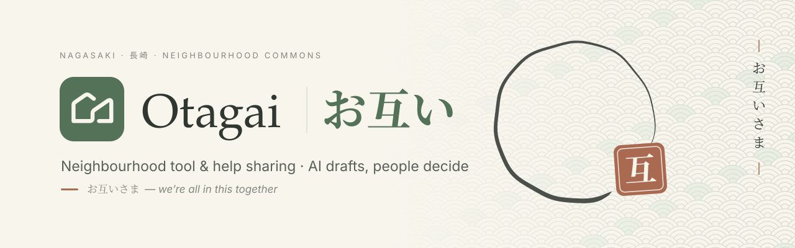

<br/>


<br/>


<br/><br/>

<sub>

[序 The problem](#序--the-problem) ·
[機能 Features](#機能--features) ·
[旅 Journey](#旅--a-day-with-otagai) ·
[設計 Architecture](#設計--architecture) ·
[流れ Flows](#流れ--key-flows) ·
[状態 States](#状態--state-machines) ·
[全体 Whole system](#全体--the-whole-system) ·
[数 Numbers](#数--by-the-numbers) ·
[始め Quick start](#始め--quick-start) ·
[守り Security](#守り--security--reliability)

</sub>

</div>


## 序 · The problem

<table>
<tr>
<td width="56%" valign="top">

Nagasaki City is **34.9 % aged 65 or older**. Small everyday jobs, such as carrying shopping up the hill slopes, taking out the garbage or changing a light bulb, get harder as neighbourhood associations shrink. Many seniors are willing to help. Matching them with people who need help still runs on phone calls and paper, and only **1.6 %** of seniors in Kagoshima take part.

Culture is the bigger barrier. **遠慮 _enryo_** (holding back) and **迷惑 _meiwaku_** (not wanting to be a burden) stop people from asking for help at all.

**Otagai lowers the cost of asking.** The AI turns a rough request into polite **敬語 _keigo_** and sends it out in widening circles of trust. People say thank you with an **お礼 _orei_** instead of a price.

> **AI drafts. People decide.** The AI never decides who is liable for anything.

</td>
<td width="44%" valign="top">

<p align="center">

&nbsp;<sub><b>Tanaka-san</b>, 78</sub>
&nbsp;&nbsp;·&nbsp;&nbsp;

&nbsp;<sub><b>Rahim</b>, neighbour</sub>
</p>
</td>
</tr>
</table>

> **繋ぐ _Tsunagu_: connection across borders.** Rahim helps Tanaka-san in Nagasaki. Through the Bangladesh culture pack (Bangla, bKash, para and building circles), he also arranges help for his mother in Cumilla.

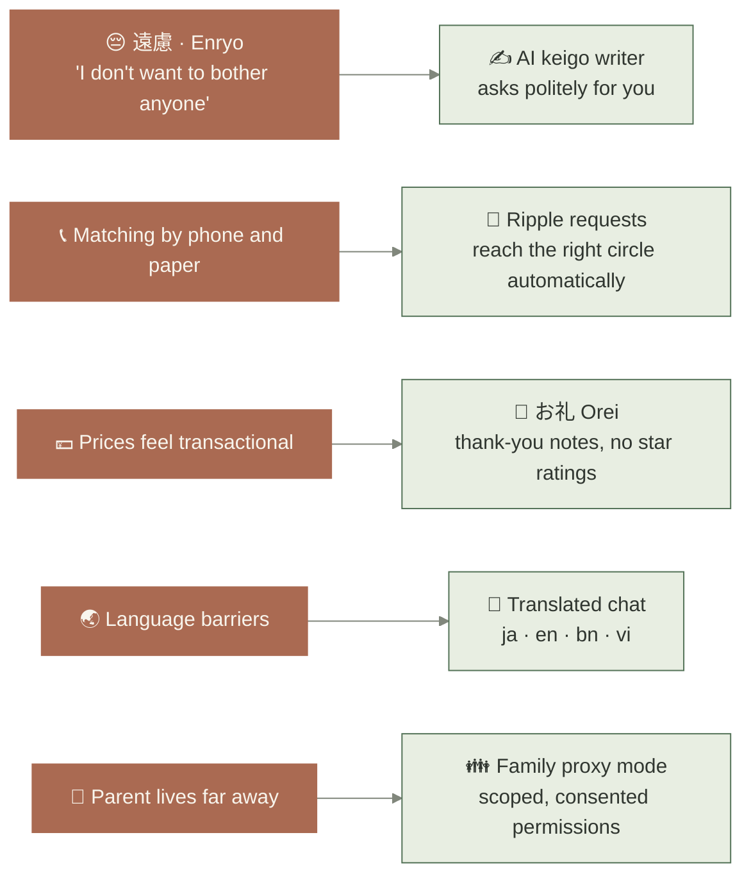
```mermaid
%%{init: {'theme':'base','themeVariables':{'primaryColor':'#E8EEE2','primaryTextColor':'#303630','primaryBorderColor':'#537257','lineColor':'#81877C','secondaryColor':'#F8F5ED','tertiaryColor':'#FFFFFF','fontFamily':'Inter, Noto Sans JP, sans-serif'}}}%%
flowchart LR
    P1["😔 遠慮 · Enryo<br/>'I don't want to bother anyone'"]:::clay --> S1["✍️ AI keigo writer<br/>asks politely for you"]
    P2["📞 Matching by phone and paper"]:::clay --> S2["🌊 Ripple requests<br/>reach the right circle automatically"]
    P3["💴 Prices feel transactional"]:::clay --> S3["🙏 お礼 Orei<br/>thank-you notes, no star ratings"]
    P4["🌏 Language barriers"]:::clay --> S4["💬 Translated chat<br/>ja · en · bn · vi"]
    P5["👵 Parent lives far away"]:::clay --> S5["👪 Family proxy mode<br/>scoped, consented permissions"]
    classDef clay fill:#AA6A52,stroke:#AA6A52,color:#F8F5ED
```


## 機能 · Features

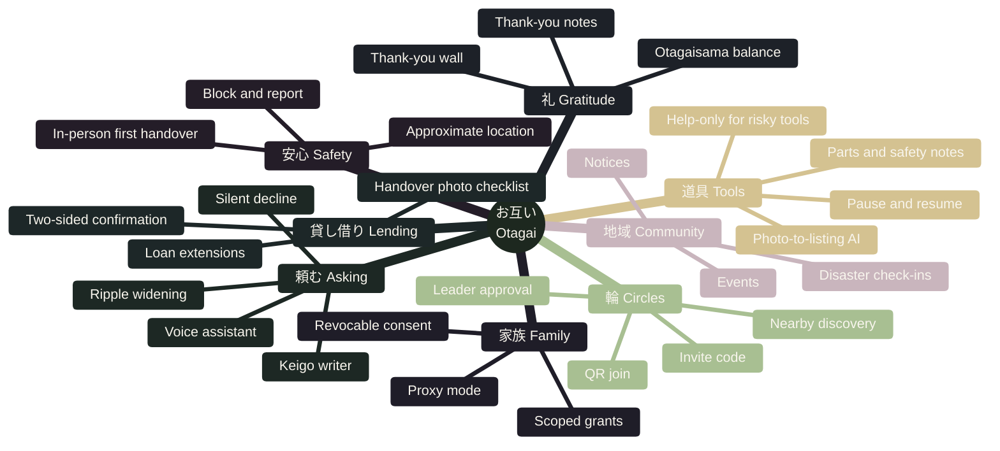
```mermaid
%%{init: {'theme':'base','themeVariables':{'primaryColor':'#537257','primaryTextColor':'#F8F5ED','primaryBorderColor':'#303630','lineColor':'#81877C','secondaryColor':'#E8EEE2','tertiaryColor':'#F8F5ED','fontFamily':'Inter, Noto Sans JP, sans-serif'}}}%%
mindmap
  root((お互い<br/>Otagai))
    輪 Circles
      Invite code
      QR join
      Nearby discovery
      Leader approval
    道具 Tools
      Photo-to-listing AI
      Parts and safety notes
      Pause and resume
      Help-only for risky tools
    頼む Asking
      Keigo writer
      Voice assistant
      Ripple widening
      Silent decline
    貸し借り Lending
      Handover photo checklist
      Loan extensions
      Two-sided confirmation
    礼 Gratitude
      Thank-you notes
      Otagaisama balance
      Thank-you wall
    家族 Family
      Proxy mode
      Scoped grants
      Revocable consent
    安心 Safety
      Block and report
      Approximate location
      In-person first handover
    地域 Community
      Notices
      Events
      Disaster check-ins
```

| | Feature | What it does |
|:-:|---|---|
| 🏘️ | **Verified circles** · 輪 | You join by invite code, QR code or location. A circle leader approves each member. |
| 🧰 | **Photo-to-listing** · 出品 | A vision model drafts the title, category, parts and safety notes. Risky tools such as ladders become _help-only_. |
| 🌊 | **Ripple requests** · 波紋 | **direct → family → han → association → nearby**, widening every 6 hours. Declining is silent. |
| ✍️ | **Polite-request writer** · 敬語 | Writes a request in keigo, polite or casual Japanese and translates it into English or Bangla. |
| 🤖 | **AI assistant** · 相談 | Voice or text chat. A tool-calling agent finds tools and helpers in your circles. |
| 📸 | **Handover checklist** · 確認 | Both sides confirm a photo checklist. The AI suggests the items, and people decide. |
| 💬 | **Translated chat** · 翻訳 | Live chat over SSE with translation of each message between Japanese, English, Bangla and Vietnamese. |
| 🙏 | **Orei, not ratings** · お礼 | Thank-you notes, a per-pair _otagaisama_ balance and a circle wall. |
| 👪 | **Family proxy** · 代理 | A family member acts for a parent with scoped, revocable permissions (`X-Acting-For`). |
| 🛡️ | **Safety** · 安心 | The circle leader moderates reports. Locations are approximate. The first handover happens in person. |
| 🔔 | **Push with quiet hours** · 通知 | A DB-backed outbox with backoff, receipt checks and quiet hours in each user's time zone. |
| 🚨 | **Community** · 地域 | Notices, events with sign-ups, disaster alerts and safety check-ins. |


## 旅 · A day with Otagai

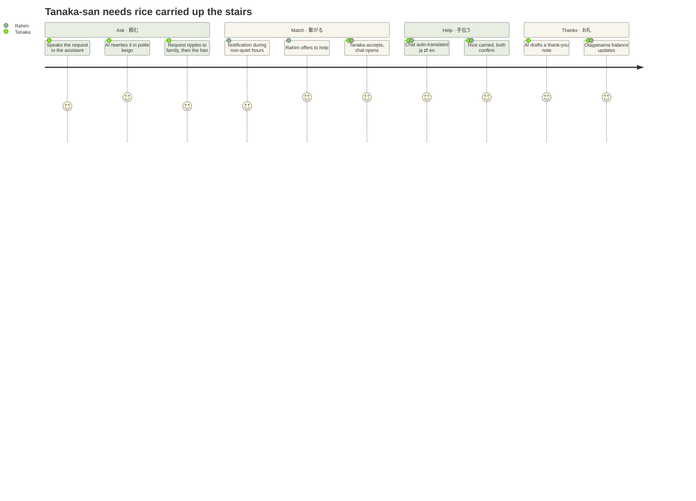
```mermaid
%%{init: {'theme':'base','themeVariables':{'primaryColor':'#E8EEE2','primaryTextColor':'#303630','primaryBorderColor':'#537257','lineColor':'#81877C','secondaryColor':'#F8F5ED','tertiaryColor':'#FFFFFF','fontFamily':'Inter, Noto Sans JP, sans-serif','fillType0':'#E8EEE2','fillType1':'#F8F5ED','fillType2':'#E8EEE2','fillType3':'#F8F5ED','actor0':'#537257','actor1':'#AA6A52','actor2':'#586057'}}}%%
journey
    title Tanaka-san needs rice carried up the stairs
    section Ask · 頼む
      Speaks the request to the assistant: 4: Tanaka
      AI rewrites it in polite keigo: 5: Tanaka
      Request ripples to family, then the han: 4: Tanaka
    section Match · 繋がる
      Notification during non-quiet hours: 4: Rahim
      Rahim offers to help: 5: Rahim
      Tanaka accepts, chat opens: 5: Tanaka, Rahim
    section Help · 手伝う
      Chat auto-translated ja ⇄ en: 5: Tanaka, Rahim
      Rice carried, both confirm: 5: Tanaka, Rahim
    section Thanks · お礼
      AI drafts a thank-you note: 5: Tanaka
      Otagaisama balance updates: 5: Tanaka, Rahim
```


## 設計 · Architecture

The sections below show each part of the system on its own, from **壱** to **拾**. The [whole-system diagram](#全体--the-whole-system) comes last.

### 壱 · Mobile app: route tree (Expo Router)

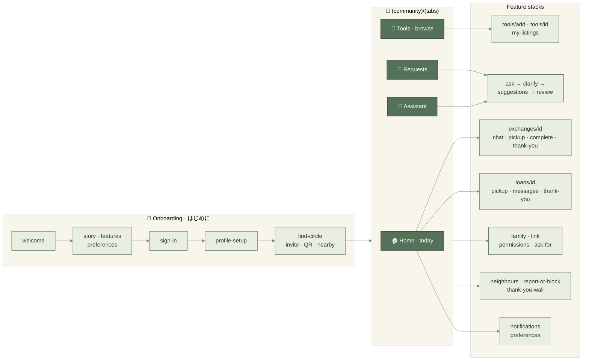
```mermaid
%%{init: {'theme':'base','themeVariables':{'primaryColor':'#E8EEE2','primaryTextColor':'#303630','primaryBorderColor':'#537257','lineColor':'#81877C','secondaryColor':'#F8F5ED','tertiaryColor':'#FFFFFF','clusterBkg':'#F8F5ED','clusterBorder':'#D9DDD2','fontFamily':'Inter, Noto Sans JP, sans-serif'}}}%%
flowchart LR
    subgraph Onboarding["🚪 Onboarding · はじめに"]
        W[welcome] --> OS[story · features<br/>preferences] --> SI[sign-in] --> PS[profile-setup] --> FC[find-circle<br/>invite · QR · nearby]
    end

    subgraph Tabs["📱 (community)/(tabs)"]
        H[🏠 Home · today]:::act
        T[🧰 Tools · browse]:::act
        R[🌊 Requests]:::act
        A[🤖 Assistant]:::act
    end

    subgraph Stacks["Feature stacks"]
        L[tools/add · tools/id<br/>my-listings]
        ASK[ask → clarify →<br/>suggestions → review]
        EX[exchanges/id<br/>chat · pickup · complete · thank-you]
        LO[loans/id<br/>pickup · messages · thank-you]
        FAM[family · link<br/>permissions · ask-for]
        SAF[neighbours · report-or-block<br/>thank-you-wall]
        NT[notifications<br/>preferences]
    end

    FC --> Tabs
    T --> L
    R --> ASK
    A --> ASK
    H --> EX & LO & NT
    Tabs --> FAM & SAF
    classDef act fill:#537257,stroke:#303630,color:#FFFFFF
```

### 弐 · Mobile app: internal layers

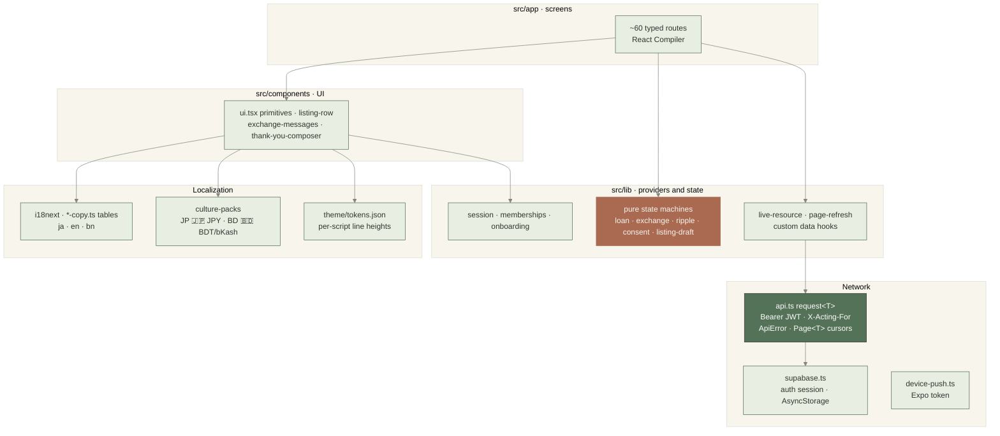
```mermaid
%%{init: {'theme':'base','themeVariables':{'primaryColor':'#E8EEE2','primaryTextColor':'#303630','primaryBorderColor':'#537257','lineColor':'#81877C','secondaryColor':'#F8F5ED','tertiaryColor':'#FFFFFF','clusterBkg':'#F8F5ED','clusterBorder':'#D9DDD2','fontFamily':'Inter, Noto Sans JP, sans-serif'}}}%%
flowchart TB
    subgraph Screens["src/app · screens"]
        SC[~60 typed routes<br/>React Compiler]
    end
    subgraph UI["src/components · UI"]
        CMP[ui.tsx primitives · listing-row<br/>exchange-messages · thank-you-composer]
    end
    subgraph State["src/lib · providers and state"]
        PRV[session · memberships · onboarding]
        SM[pure state machines<br/>loan · exchange · ripple · consent · listing-draft]:::clay
        LRS[live-resource · page-refresh<br/>custom data hooks]
    end
    subgraph Locale["Localization"]
        I18N[i18next · *-copy.ts tables<br/>ja · en · bn]
        CP[culture-packs<br/>JP 🇯🇵 JPY · BD 🇧🇩 BDT/bKash]
        TH[theme/tokens.json<br/>per-script line heights]
    end
    subgraph Net["Network"]
        API["api.ts request&lt;T&gt;<br/>Bearer JWT · X-Acting-For<br/>ApiError · Page&lt;T&gt; cursors"]:::act
        SB[supabase.ts<br/>auth session · AsyncStorage]
        PUSH[device-push.ts<br/>Expo token]
    end
    SC --> CMP --> PRV
    SC --> LRS --> API
    SC --> SM
    CMP --> I18N & CP & TH
    API --> SB
    classDef act fill:#537257,stroke:#303630,color:#FFFFFF
    classDef clay fill:#AA6A52,stroke:#AA6A52,color:#F8F5ED
```

### 参 · Backend: layers (FastAPI)

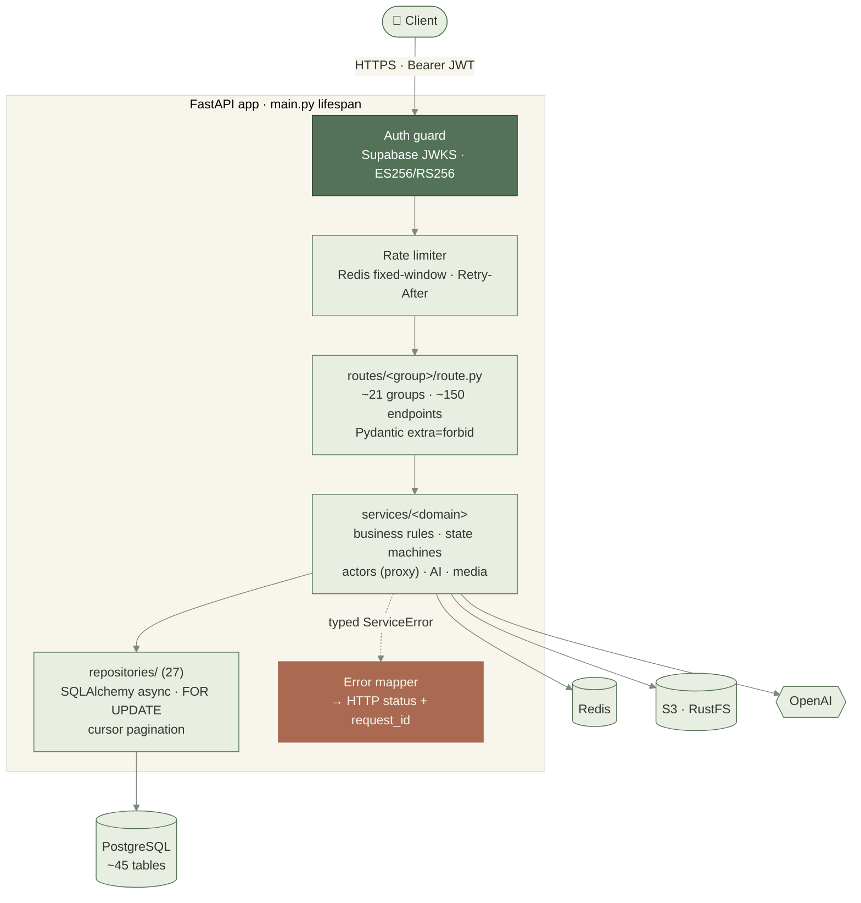
```mermaid
%%{init: {'theme':'base','themeVariables':{'primaryColor':'#E8EEE2','primaryTextColor':'#303630','primaryBorderColor':'#537257','lineColor':'#81877C','secondaryColor':'#F8F5ED','tertiaryColor':'#FFFFFF','clusterBkg':'#F8F5ED','clusterBorder':'#D9DDD2','fontFamily':'Inter, Noto Sans JP, sans-serif'}}}%%
flowchart TB
    C([📱 Client]) -->|HTTPS · Bearer JWT| MW
    subgraph App["FastAPI app · main.py lifespan"]
        MW["Auth guard<br/>Supabase JWKS · ES256/RS256"]:::act --> RL["Rate limiter<br/>Redis fixed-window · Retry-After"]
        RL --> RT["routes/&lt;group&gt;/route.py<br/>~21 groups · ~150 endpoints<br/>Pydantic extra=forbid"]
        RT --> SV["services/&lt;domain&gt;<br/>business rules · state machines<br/>actors (proxy) · AI · media"]
        SV --> RP["repositories/ (27)<br/>SQLAlchemy async · FOR UPDATE<br/>cursor pagination"]
        SV -. typed ServiceError .-> EM["Error mapper<br/>→ HTTP status + request_id"]:::clay
    end
    RP --> PG[(PostgreSQL<br/>~45 tables)]
    SV --> RD[(Redis)]
    SV --> S3[(S3 · RustFS)]
    SV --> OAI{{OpenAI}}
    classDef act fill:#537257,stroke:#303630,color:#FFFFFF
    classDef clay fill:#AA6A52,stroke:#AA6A52,color:#F8F5ED
```

### 肆 · Backend: life of a request

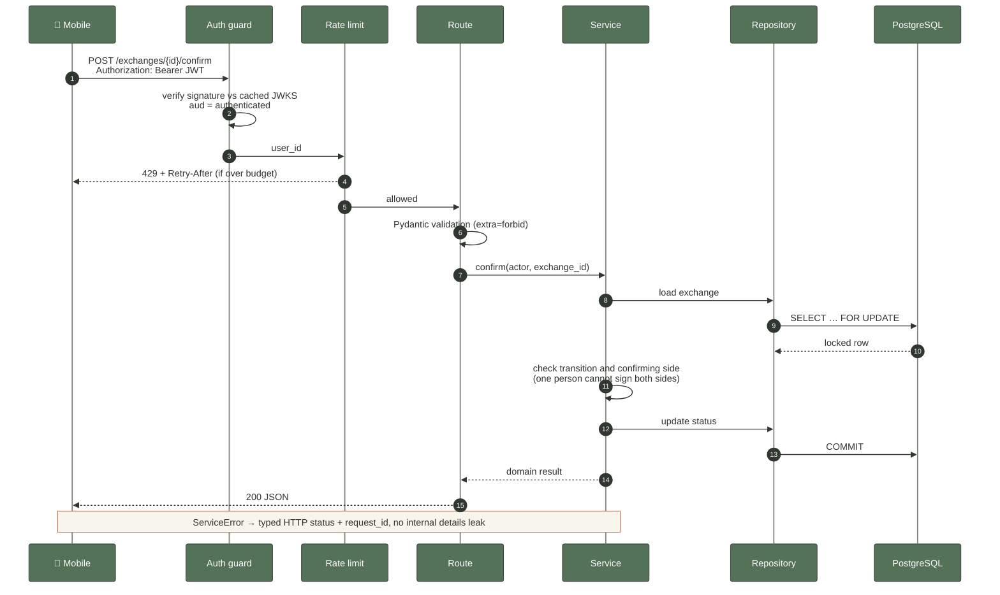
```mermaid
%%{init: {'theme':'base','themeVariables':{'actorBkg':'#537257','actorTextColor':'#FFFFFF','actorBorder':'#303630','actorLineColor':'#81877C','signalColor':'#303630','signalTextColor':'#303630','labelBoxBkgColor':'#E8EEE2','labelBoxBorderColor':'#537257','loopTextColor':'#303630','noteBkgColor':'#F8F5ED','noteBorderColor':'#AA6A52','noteTextColor':'#303630','activationBkgColor':'#E8EEE2','activationBorderColor':'#537257','fontFamily':'Inter, Noto Sans JP, sans-serif'}}}%%
sequenceDiagram
    autonumber
    participant M as 📱 Mobile
    participant G as Auth guard
    participant L as Rate limit
    participant R as Route
    participant S as Service
    participant D as Repository
    participant P as PostgreSQL
    M->>G: POST /exchanges/{id}/confirm<br/>Authorization: Bearer JWT
    G->>G: verify signature vs cached JWKS<br/>aud = authenticated
    G->>L: user_id
    L-->>M: 429 + Retry-After (if over budget)
    L->>R: allowed
    R->>R: Pydantic validation (extra=forbid)
    R->>S: confirm(actor, exchange_id)
    S->>D: load exchange
    D->>P: SELECT … FOR UPDATE
    P-->>D: locked row
    S->>S: check transition and confirming side<br/>(one person cannot sign both sides)
    S->>D: update status
    D->>P: COMMIT
    S-->>R: domain result
    R-->>M: 200 JSON
    Note over S,M: ServiceError → typed HTTP status + request_id, no internal details leak
```

### 伍 · AI pipeline: AI drafts, the backend validates, people confirm

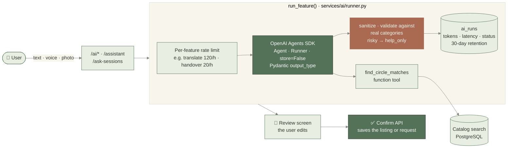
```mermaid
%%{init: {'theme':'base','themeVariables':{'primaryColor':'#E8EEE2','primaryTextColor':'#303630','primaryBorderColor':'#537257','lineColor':'#81877C','secondaryColor':'#F8F5ED','tertiaryColor':'#FFFFFF','clusterBkg':'#F8F5ED','clusterBorder':'#D9DDD2','fontFamily':'Inter, Noto Sans JP, sans-serif'}}}%%
flowchart LR
    U([👤 User]) -->|text · voice · photo| EP["/ai/* · /assistant<br/>/ask-sessions"]
    EP --> RUN
    subgraph RUN["run_feature() · services/ai/runner.py"]
        direction TB
        LIM["Per-feature rate limit<br/>e.g. translate 120/h · handover 20/h"] --> AG["OpenAI Agents SDK<br/>Agent · Runner · store=False<br/>Pydantic output_type"]:::act
        AG --> TOOL["find_circle_matches<br/>function tool"]
        AG --> SAN["sanitize · validate against<br/>real categories<br/>risky → help_only"]:::clay
        SAN --> LOG[("ai_runs<br/>tokens · latency · status<br/>30-day retention")]
    end
    TOOL --> DB[(Catalog search<br/>PostgreSQL)]
    RUN --> REV["📱 Review screen<br/>the user edits"] --> CONF["✅ Confirm API<br/>saves the listing or request"]:::act
    classDef act fill:#537257,stroke:#303630,color:#FFFFFF
    classDef clay fill:#AA6A52,stroke:#AA6A52,color:#F8F5ED
```

| AI feature | Endpoint | Used for |
|---|---|---|
| `polite_writer` | `POST /ai/request-drafts` | Writing requests in keigo, polite or casual style, with translation |
| `task_to_tools` | `/assistant/turns` · `/ask-sessions` | "I need to hang a shelf" → drill, level, helper |
| `photo_listing` | `POST /ai/listing-drafts` | Vision-drafted listings |
| `handover_checklist` | `POST /exchanges/{id}/handover-checks` | Suggested items for the pickup and return photo check |
| `thank_you` · `extension_draft` | `/ai/thank-you-drafts` · `/ai/extension-drafts` | Drafts of gratitude and loan-extension messages |
| `translate` · `transcribe` | `/ai/translations` · `/ai/transcriptions` | Chat translation and Whisper voice input |
| `intro_card` · `tool_guide` | `/ai/intro-cards` · `/ai/tool-guides` | Introductions to neighbours and how-to guides for tools |

<details>
<summary>📐 <b>Original AI design diagrams</b></summary>
<br/>
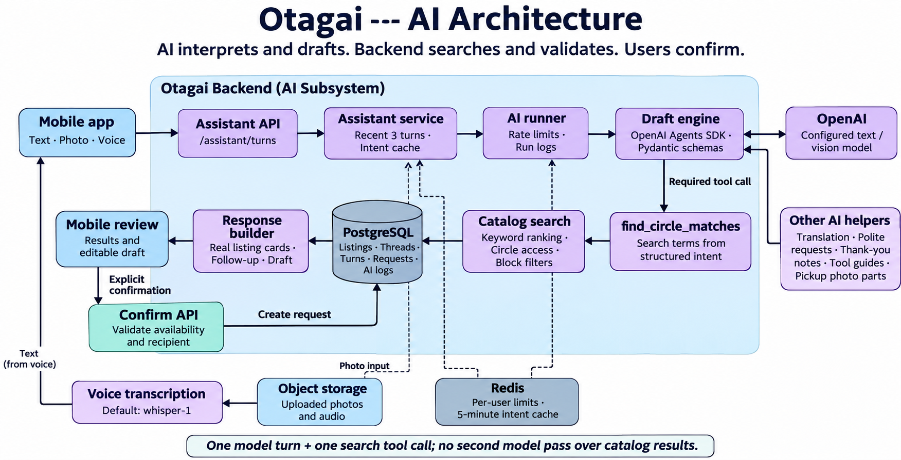
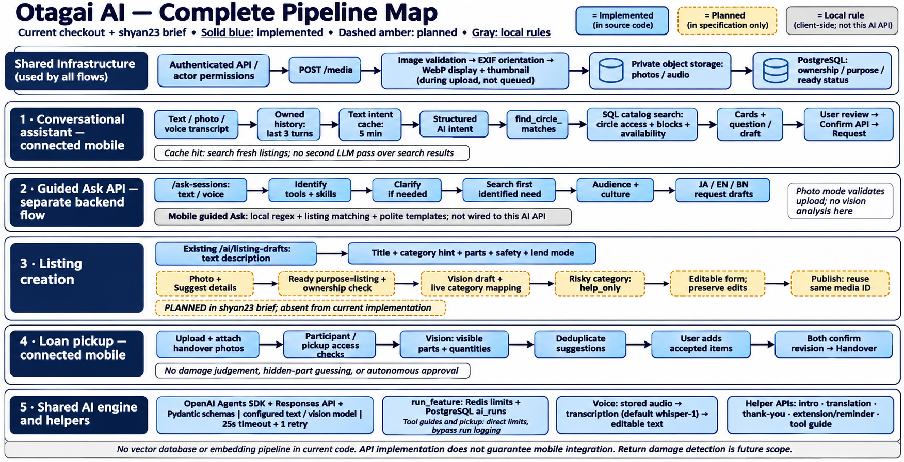
</details>

### 陸 · Data model

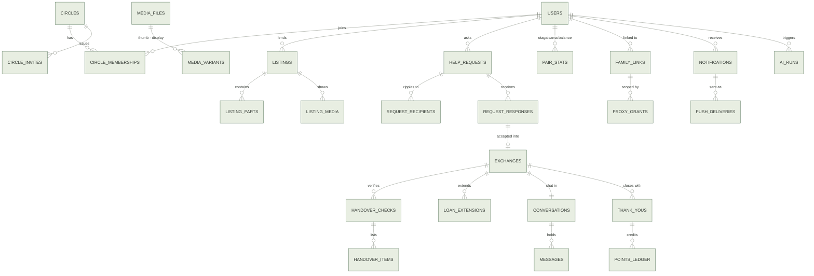
```mermaid
%%{init: {'theme':'base','themeVariables':{'primaryColor':'#E8EEE2','primaryTextColor':'#303630','primaryBorderColor':'#537257','lineColor':'#81877C','secondaryColor':'#F8F5ED','tertiaryColor':'#FFFFFF','fontFamily':'Inter, Noto Sans JP, sans-serif'}}}%%
erDiagram
    USERS ||--o{ CIRCLE_MEMBERSHIPS : joins
    CIRCLES ||--o{ CIRCLE_MEMBERSHIPS : has
    CIRCLES ||--o{ CIRCLE_INVITES : issues
    USERS ||--o{ LISTINGS : lends
    LISTINGS ||--o{ LISTING_PARTS : contains
    LISTINGS ||--o{ LISTING_MEDIA : shows
    MEDIA_FILES ||--o{ MEDIA_VARIANTS : "thumb · display"
    USERS ||--o{ HELP_REQUESTS : asks
    HELP_REQUESTS ||--o{ REQUEST_RECIPIENTS : "ripples to"
    HELP_REQUESTS ||--o{ REQUEST_RESPONSES : receives
    REQUEST_RESPONSES ||--o| EXCHANGES : "accepted into"
    EXCHANGES ||--o{ HANDOVER_CHECKS : verifies
    HANDOVER_CHECKS ||--o{ HANDOVER_ITEMS : lists
    EXCHANGES ||--o{ LOAN_EXTENSIONS : extends
    EXCHANGES ||--|| CONVERSATIONS : "chat in"
    CONVERSATIONS ||--o{ MESSAGES : holds
    EXCHANGES ||--o{ THANK_YOUS : "closes with"
    THANK_YOUS ||--o{ POINTS_LEDGER : credits
    USERS ||--o{ PAIR_STATS : "otagaisama balance"
    USERS ||--o{ FAMILY_LINKS : "linked to"
    FAMILY_LINKS ||--o{ PROXY_GRANTS : "scoped by"
    USERS ||--o{ NOTIFICATIONS : receives
    NOTIFICATIONS ||--o{ PUSH_DELIVERIES : "sent as"
    USERS ||--o{ AI_RUNS : triggers
```

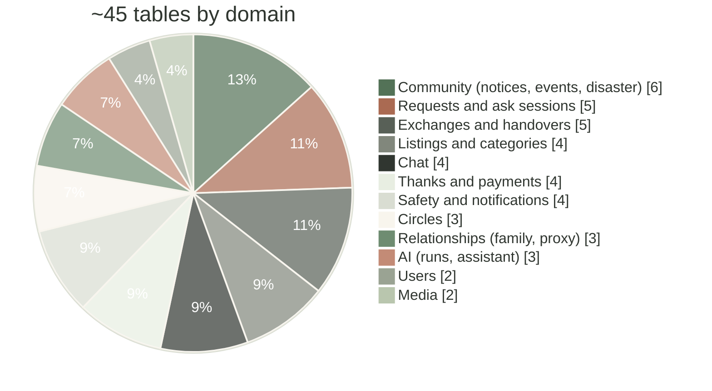
```mermaid
%%{init: {'theme':'base','themeVariables':{'pie1':'#537257','pie2':'#AA6A52','pie3':'#586057','pie4':'#81877C','pie5':'#303630','pie6':'#E8EEE2','pie7':'#D9DDD2','pie8':'#F8F5ED','pie9':'#6E8C71','pie10':'#C38B76','pie11':'#9AA393','pie12':'#B9C6AE','pieStrokeColor':'#F8F5ED','pieOuterStrokeColor':'#D9DDD2','pieTitleTextColor':'#303630','pieSectionTextColor':'#FFFFFF','pieLegendTextColor':'#303630','fontFamily':'Inter, Noto Sans JP, sans-serif'}}}%%
pie showData
    title ~45 tables by domain
    "Community (notices, events, disaster)" : 6
    "Requests and ask sessions" : 5
    "Exchanges and handovers" : 5
    "Listings and categories" : 4
    "Chat" : 4
    "Thanks and payments" : 4
    "Safety and notifications" : 4
    "Circles" : 3
    "Relationships (family, proxy)" : 3
    "AI (runs, assistant)" : 3
    "Users" : 2
    "Media" : 2
```

### 漆 · Ripple requests: 波紋

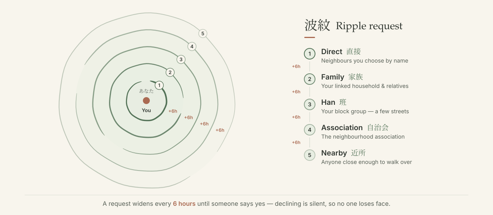

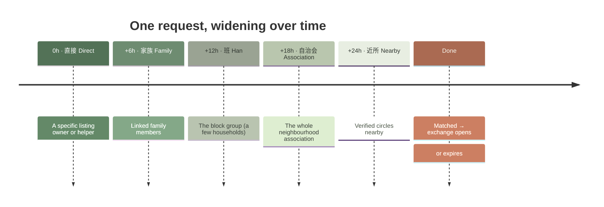
```mermaid
%%{init: {'theme':'base','themeVariables':{'cScale0':'#537257','cScaleLabel0':'#FFFFFF','cScale1':'#6E8C71','cScaleLabel1':'#FFFFFF','cScale2':'#9AA393','cScaleLabel2':'#303630','cScale3':'#B9C6AE','cScaleLabel3':'#303630','cScale4':'#E8EEE2','cScaleLabel4':'#303630','cScale5':'#AA6A52','cScaleLabel5':'#F8F5ED','fontFamily':'Inter, Noto Sans JP, sans-serif'}}}%%
timeline
    title One request, widening over time
    0h  · 直接 Direct : A specific listing owner or helper
    +6h · 家族 Family : Linked family members
    +12h · 班 Han : The block group (a few households)
    +18h · 自治会 Association : The whole neighbourhood association
    +24h · 近所 Nearby : Verified circles nearby
    Done : Matched → exchange opens : or expires
```

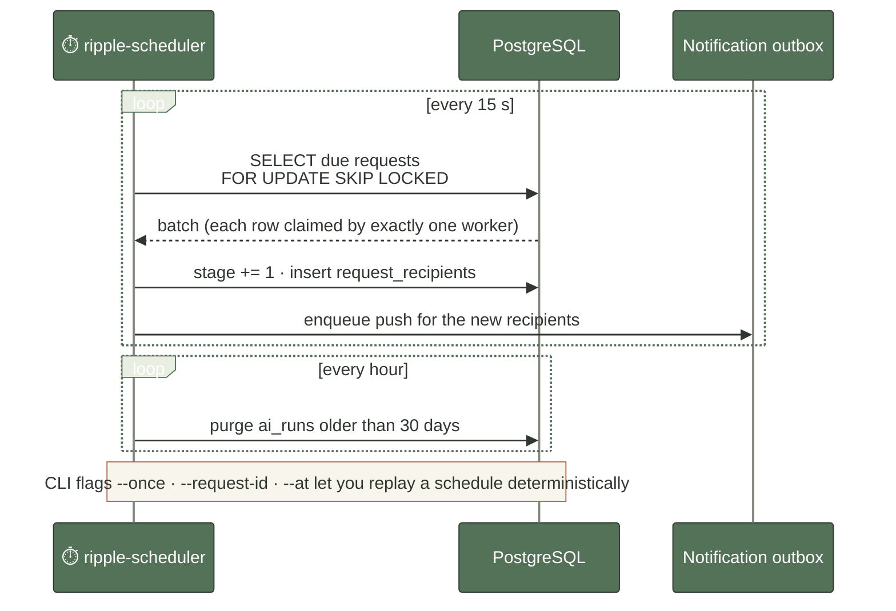
```mermaid
%%{init: {'theme':'base','themeVariables':{'actorBkg':'#537257','actorTextColor':'#FFFFFF','actorBorder':'#303630','actorLineColor':'#81877C','signalColor':'#303630','signalTextColor':'#303630','labelBoxBkgColor':'#E8EEE2','labelBoxBorderColor':'#537257','loopTextColor':'#303630','noteBkgColor':'#F8F5ED','noteBorderColor':'#AA6A52','noteTextColor':'#303630','fontFamily':'Inter, Noto Sans JP, sans-serif'}}}%%
sequenceDiagram
    participant SCH as ⏱️ ripple-scheduler
    participant DB as PostgreSQL
    participant OUT as Notification outbox
    loop every 15 s
        SCH->>DB: SELECT due requests<br/>FOR UPDATE SKIP LOCKED
        DB-->>SCH: batch (each row claimed by exactly one worker)
        SCH->>DB: stage += 1 · insert request_recipients
        SCH->>OUT: enqueue push for the new recipients
    end
    loop every hour
        SCH->>DB: purge ai_runs older than 30 days
    end
    Note over SCH,DB: CLI flags --once · --request-id · --at let you replay a schedule deterministically
```

### 捌 · Background workers

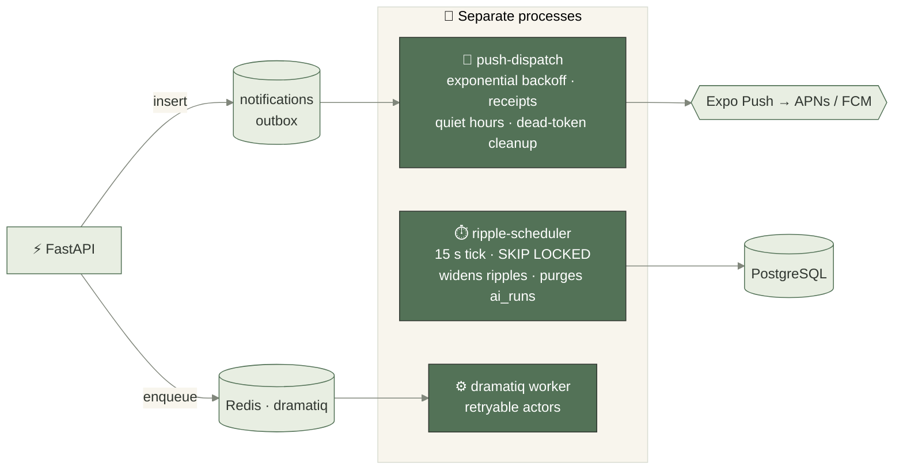
```mermaid
%%{init: {'theme':'base','themeVariables':{'primaryColor':'#E8EEE2','primaryTextColor':'#303630','primaryBorderColor':'#537257','lineColor':'#81877C','secondaryColor':'#F8F5ED','tertiaryColor':'#FFFFFF','clusterBkg':'#F8F5ED','clusterBorder':'#D9DDD2','fontFamily':'Inter, Noto Sans JP, sans-serif'}}}%%
flowchart LR
    API[⚡ FastAPI] -->|insert| OUT[(notifications<br/>outbox)]
    API -->|enqueue| Q[(Redis · dramatiq)]
    subgraph Workers["🔁 Separate processes"]
        SCH["⏱️ ripple-scheduler<br/>15 s tick · SKIP LOCKED<br/>widens ripples · purges ai_runs"]:::act
        PD["🔔 push-dispatch<br/>exponential backoff · receipts<br/>quiet hours · dead-token cleanup"]:::act
        WK["⚙️ dramatiq worker<br/>retryable actors"]:::act
    end
    SCH --> PG[(PostgreSQL)]
    OUT --> PD --> EXPO{{Expo Push → APNs / FCM}}
    Q --> WK
    classDef act fill:#537257,stroke:#303630,color:#FFFFFF
```

### 玖 · Local development stack

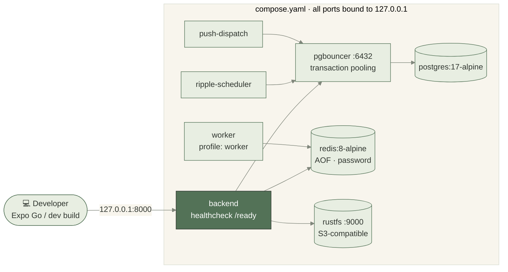
```mermaid
%%{init: {'theme':'base','themeVariables':{'primaryColor':'#E8EEE2','primaryTextColor':'#303630','primaryBorderColor':'#537257','lineColor':'#81877C','secondaryColor':'#F8F5ED','tertiaryColor':'#FFFFFF','clusterBkg':'#F8F5ED','clusterBorder':'#D9DDD2','fontFamily':'Inter, Noto Sans JP, sans-serif'}}}%%
flowchart LR
    DEV([💻 Developer<br/>Expo Go / dev build]) -->|127.0.0.1:8000| BE
    subgraph Compose["compose.yaml · all ports bound to 127.0.0.1"]
        BE[backend<br/>healthcheck /ready]:::act
        SCH[ripple-scheduler]
        PD[push-dispatch]
        WK[worker<br/>profile: worker]
        PGB[pgbouncer :6432<br/>transaction pooling]
        PG[(postgres:17-alpine)]
        RD[(redis:8-alpine<br/>AOF · password)]
        S3[(rustfs :9000<br/>S3-compatible)]
    end
    BE & SCH & PD --> PGB --> PG
    BE & WK --> RD
    BE --> S3
    classDef act fill:#537257,stroke:#303630,color:#FFFFFF
```

### 拾 · Production deployment

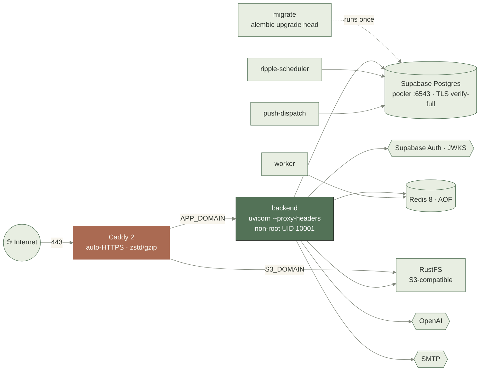
```mermaid
%%{init: {'theme':'base','themeVariables':{'primaryColor':'#E8EEE2','primaryTextColor':'#303630','primaryBorderColor':'#537257','lineColor':'#81877C','secondaryColor':'#F8F5ED','tertiaryColor':'#FFFFFF','clusterBkg':'#F8F5ED','clusterBorder':'#D9DDD2','fontFamily':'Inter, Noto Sans JP, sans-serif'}}}%%
flowchart LR
    NET((🌐 Internet)) -->|443| CADDY["Caddy 2<br/>auto-HTTPS · zstd/gzip"]:::clay
    CADDY -->|APP_DOMAIN| BE["backend<br/>uvicorn --proxy-headers<br/>non-root UID 10001"]:::act
    CADDY -->|S3_DOMAIN| S3["RustFS<br/>S3-compatible"]
    MIG["migrate<br/>alembic upgrade head"] -. runs once .-> SPG
    BE --> SPG[("Supabase Postgres<br/>pooler :6543 · TLS verify-full")]
    BE --> SAUTH{{Supabase Auth · JWKS}}
    BE --> REDIS[(Redis 8 · AOF)]
    BE --> S3
    BE --> OAI{{OpenAI}}
    BE --> SMTP{{SMTP}}
    SCH[ripple-scheduler] --> SPG
    PD[push-dispatch] --> SPG
    WK[worker] --> REDIS
    classDef act fill:#537257,stroke:#303630,color:#FFFFFF
    classDef clay fill:#AA6A52,stroke:#AA6A52,color:#F8F5ED
```


## 流れ · Key flows

### 📸 Lending a tool: photo to listing

<table><tr>
<td width="34%" valign="top"><br/><sub>Take a photo of the drill, and the AI drafts the listing.</sub></td>
<td width="66%" valign="top">

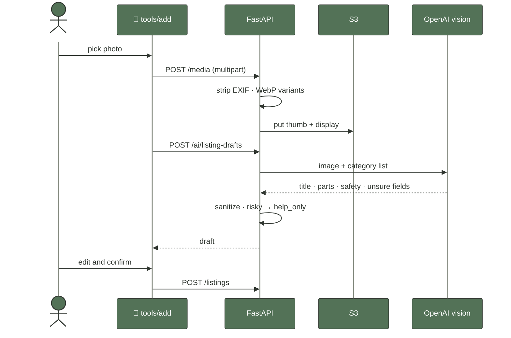
```mermaid
%%{init: {'theme':'base','themeVariables':{'actorBkg':'#537257','actorTextColor':'#FFFFFF','actorBorder':'#303630','actorLineColor':'#81877C','signalColor':'#303630','signalTextColor':'#303630','noteBkgColor':'#F8F5ED','noteBorderColor':'#AA6A52','noteTextColor':'#303630','fontFamily':'Inter, Noto Sans JP, sans-serif'}}}%%
sequenceDiagram
    actor O as Owner
    participant M as 📱 tools/add
    participant API as FastAPI
    participant S3 as S3
    participant AI as OpenAI vision
    O->>M: pick photo
    M->>API: POST /media (multipart)
    API->>API: strip EXIF · WebP variants
    API->>S3: put thumb + display
    M->>API: POST /ai/listing-drafts
    API->>AI: image + category list
    AI-->>API: title · parts · safety · unsure fields
    API->>API: sanitize · risky → help_only
    API-->>M: draft
    O->>M: edit and confirm
    M->>API: POST /listings
```

</td>
</tr></table>

### 🤝 Borrowing: request to thank-you

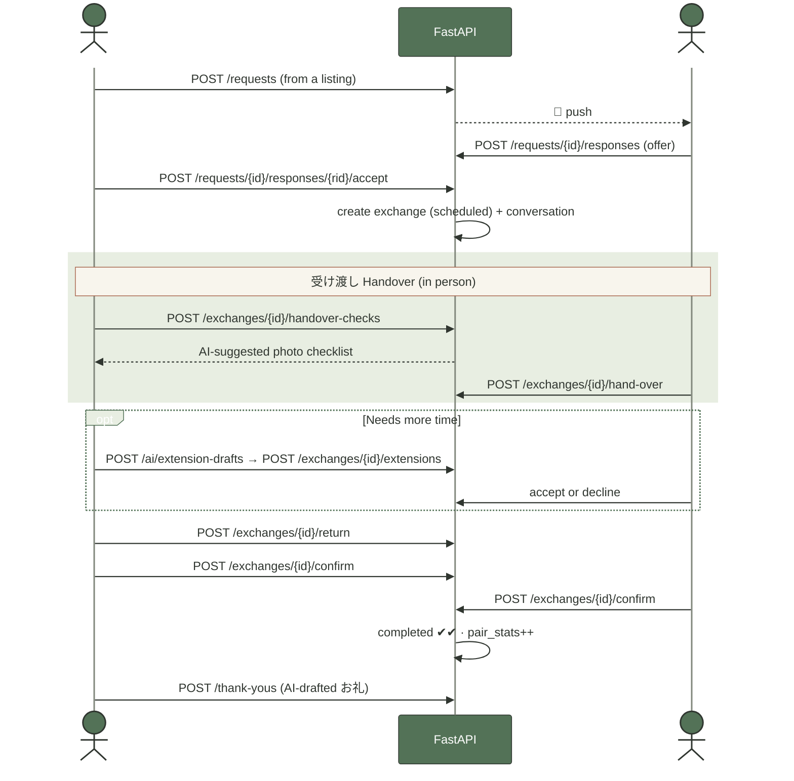
```mermaid
%%{init: {'theme':'base','themeVariables':{'actorBkg':'#537257','actorTextColor':'#FFFFFF','actorBorder':'#303630','actorLineColor':'#81877C','signalColor':'#303630','signalTextColor':'#303630','labelBoxBkgColor':'#E8EEE2','labelBoxBorderColor':'#537257','loopTextColor':'#303630','noteBkgColor':'#F8F5ED','noteBorderColor':'#AA6A52','noteTextColor':'#303630','fontFamily':'Inter, Noto Sans JP, sans-serif'}}}%%
sequenceDiagram
    actor B as Borrower
    participant API as FastAPI
    actor L as Lender
    B->>API: POST /requests (from a listing)
    API-->>L: 🔔 push
    L->>API: POST /requests/{id}/responses (offer)
    B->>API: POST /requests/{id}/responses/{rid}/accept
    API->>API: create exchange (scheduled) + conversation
    rect rgb(232, 238, 226)
    note over B,L: 受け渡し Handover (in person)
    B->>API: POST /exchanges/{id}/handover-checks
    API-->>B: AI-suggested photo checklist
    L->>API: POST /exchanges/{id}/hand-over
    end
    opt Needs more time
    B->>API: POST /ai/extension-drafts → POST /exchanges/{id}/extensions
    L->>API: accept or decline
    end
    B->>API: POST /exchanges/{id}/return
    B->>API: POST /exchanges/{id}/confirm
    L->>API: POST /exchanges/{id}/confirm
    API->>API: completed ✔✔ · pair_stats++
    B->>API: POST /thank-yous (AI-drafted お礼)
```

### 👪 Family proxy: acting for a parent

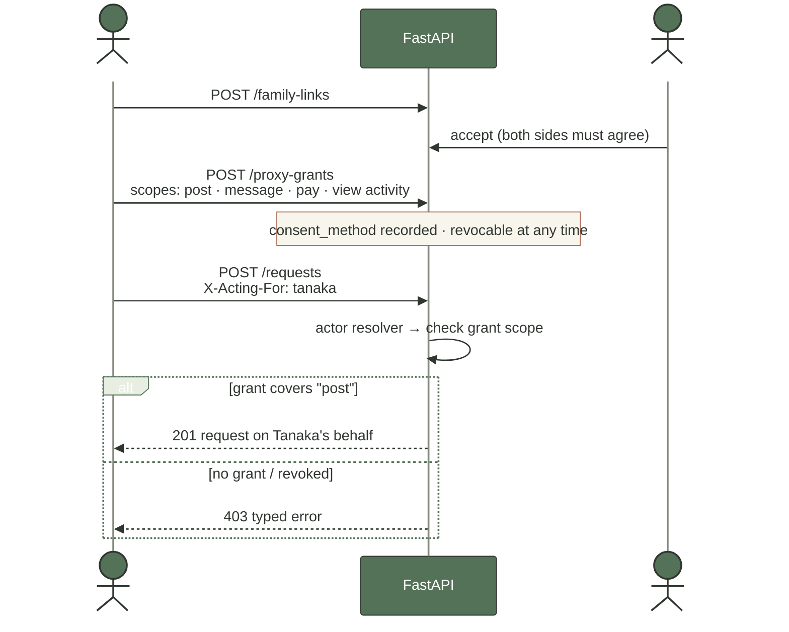
```mermaid
%%{init: {'theme':'base','themeVariables':{'actorBkg':'#537257','actorTextColor':'#FFFFFF','actorBorder':'#303630','actorLineColor':'#81877C','signalColor':'#303630','signalTextColor':'#303630','labelBoxBkgColor':'#E8EEE2','labelBoxBorderColor':'#537257','loopTextColor':'#303630','noteBkgColor':'#F8F5ED','noteBorderColor':'#AA6A52','noteTextColor':'#303630','fontFamily':'Inter, Noto Sans JP, sans-serif'}}}%%
sequenceDiagram
    actor D as Daughter (Fukuoka)
    participant API as FastAPI
    actor T as Tanaka-san
    D->>API: POST /family-links
    T->>API: accept (both sides must agree)
    D->>API: POST /proxy-grants<br/>scopes: post · message · pay · view activity
    Note over API: consent_method recorded · revocable at any time
    D->>API: POST /requests<br/>X-Acting-For: tanaka
    API->>API: actor resolver → check grant scope
    alt grant covers "post"
        API-->>D: 201 request on Tanaka's behalf
    else no grant / revoked
        API-->>D: 403 typed error
    end
```

### 💬 Chat with live translation

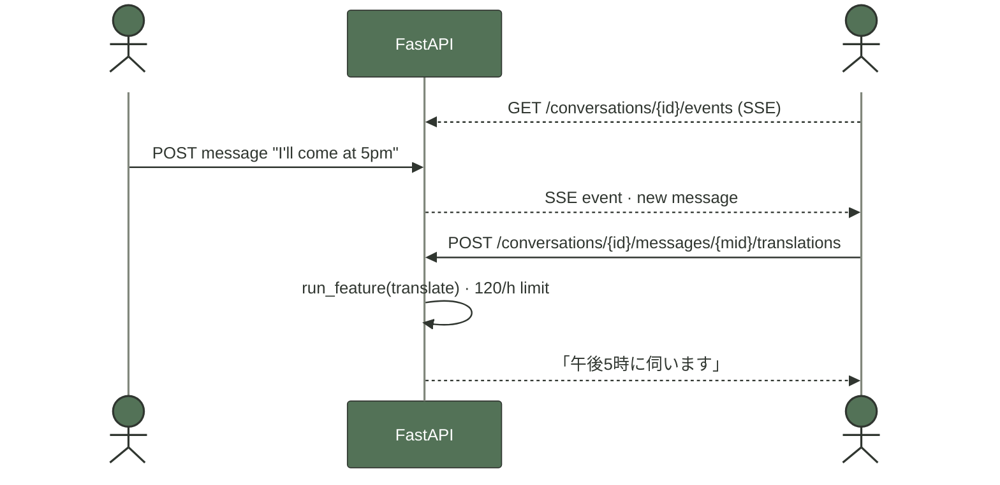
```mermaid
%%{init: {'theme':'base','themeVariables':{'actorBkg':'#537257','actorTextColor':'#FFFFFF','actorBorder':'#303630','actorLineColor':'#81877C','signalColor':'#303630','signalTextColor':'#303630','noteBkgColor':'#F8F5ED','noteBorderColor':'#AA6A52','noteTextColor':'#303630','fontFamily':'Inter, Noto Sans JP, sans-serif'}}}%%
sequenceDiagram
    actor R as Rahim (en)
    participant API as FastAPI
    actor T as Tanaka (ja)
    T-->>API: GET /conversations/{id}/events (SSE)
    R->>API: POST message "I'll come at 5pm"
    API-->>T: SSE event · new message
    T->>API: POST /conversations/{id}/messages/{mid}/translations
    API->>API: run_feature(translate) · 120/h limit
    API-->>T: 「午後5時に伺います」
```

### 🔔 Push delivery

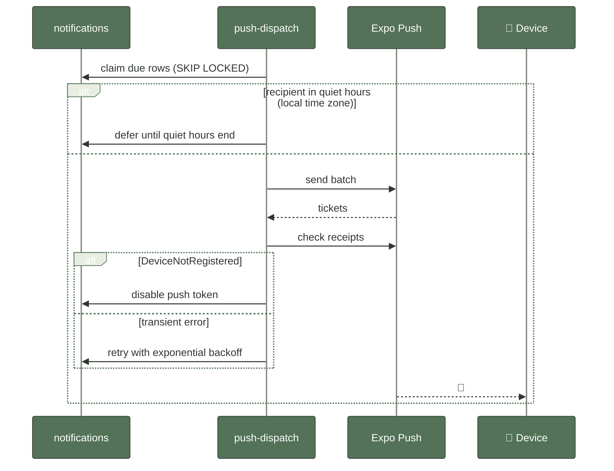
```mermaid
%%{init: {'theme':'base','themeVariables':{'actorBkg':'#537257','actorTextColor':'#FFFFFF','actorBorder':'#303630','actorLineColor':'#81877C','signalColor':'#303630','signalTextColor':'#303630','labelBoxBkgColor':'#E8EEE2','labelBoxBorderColor':'#537257','loopTextColor':'#303630','noteBkgColor':'#F8F5ED','noteBorderColor':'#AA6A52','noteTextColor':'#303630','fontFamily':'Inter, Noto Sans JP, sans-serif'}}}%%
sequenceDiagram
    participant OUT as notifications
    participant PD as push-dispatch
    participant EX as Expo Push
    participant PH as 📱 Device
    PD->>OUT: claim due rows (SKIP LOCKED)
    alt recipient in quiet hours (local time zone)
        PD->>OUT: defer until quiet hours end
    else
        PD->>EX: send batch
        EX-->>PD: tickets
        PD->>EX: check receipts
        alt DeviceNotRegistered
            PD->>OUT: disable push token
        else transient error
            PD->>OUT: retry with exponential backoff
        end
        EX-->>PH: 🔔
    end
```


## 状態 · State machines

Every core entity has an explicit lifecycle. Transitions are enforced in the services and protected by row locks.

<table>
<tr>
<td width="50%" valign="top">

**Exchange · 貸し借り**

```mermaid
%%{init: {'theme':'base','themeVariables':{'primaryColor':'#E8EEE2','primaryTextColor':'#303630','primaryBorderColor':'#537257','lineColor':'#81877C','fontFamily':'Inter, sans-serif'}}}%%
stateDiagram-v2
    [*] --> scheduled
    scheduled --> active: hand-over
    scheduled --> cancelled
    active --> returned: return
    returned --> completed: both confirm ✔✔
    active --> disputed
    returned --> disputed
    completed --> [*]
```

</td>
<td width="50%" valign="top">

**Help request · 依頼**

```mermaid
%%{init: {'theme':'base','themeVariables':{'primaryColor':'#E8EEE2','primaryTextColor':'#303630','primaryBorderColor':'#537257','lineColor':'#81877C','fontFamily':'Inter, sans-serif'}}}%%
stateDiagram-v2
    [*] --> open
    open --> matched: response accepted
    open --> expired: ripple exhausted
    open --> cancelled
    matched --> in_progress
    in_progress --> done
    done --> [*]
```

</td>
</tr>
<tr>
<td valign="top">

**Response · 返事**

```mermaid
%%{init: {'theme':'base','themeVariables':{'primaryColor':'#E8EEE2','primaryTextColor':'#303630','primaryBorderColor':'#537257','lineColor':'#81877C','fontFamily':'Inter, sans-serif'}}}%%
stateDiagram-v2
    [*] --> pending
    pending --> accepted
    pending --> superseded: another accepted
    pending --> withdrawn
    pending --> expired
```

</td>
<td valign="top">

**Listing · 出品**

```mermaid
%%{init: {'theme':'base','themeVariables':{'primaryColor':'#E8EEE2','primaryTextColor':'#303630','primaryBorderColor':'#537257','lineColor':'#81877C','fontFamily':'Inter, sans-serif'}}}%%
stateDiagram-v2
    [*] --> active
    active --> paused: pause
    paused --> active: resume
    active --> lent_out: exchange starts
    lent_out --> active: completed
    active --> deleted
    paused --> deleted
```

</td>
</tr>
<tr>
<td valign="top">

**Circle membership · 会員**

```mermaid
%%{init: {'theme':'base','themeVariables':{'primaryColor':'#E8EEE2','primaryTextColor':'#303630','primaryBorderColor':'#537257','lineColor':'#81877C','fontFamily':'Inter, sans-serif'}}}%%
stateDiagram-v2
    [*] --> pending: join
    pending --> approved: leader approves
    pending --> rejected
    approved --> removed: by leader
    approved --> left: by member
```

</td>
<td valign="top">

**Ask session · 相談**

```mermaid
%%{init: {'theme':'base','themeVariables':{'primaryColor':'#E8EEE2','primaryTextColor':'#303630','primaryBorderColor':'#537257','lineColor':'#81877C','fontFamily':'Inter, sans-serif'}}}%%
stateDiagram-v2
    [*] --> clarifying
    clarifying --> results: answered
    results --> drafted: draft
    drafted --> sent
    clarifying --> abandoned
    results --> abandoned
```

</td>
</tr>
<tr>
<td valign="top">

**Payment · 支払い**

```mermaid
%%{init: {'theme':'base','themeVariables':{'primaryColor':'#E8EEE2','primaryTextColor':'#303630','primaryBorderColor':'#537257','lineColor':'#81877C','fontFamily':'Inter, sans-serif'}}}%%
stateDiagram-v2
    [*] --> requires_payment
    requires_payment --> processing
    processing --> succeeded
    processing --> failed
    requires_payment --> cancelled
    succeeded --> refunded
```

</td>
<td valign="top">

**Loan extension · 延長**

```mermaid
%%{init: {'theme':'base','themeVariables':{'primaryColor':'#E8EEE2','primaryTextColor':'#303630','primaryBorderColor':'#537257','lineColor':'#81877C','fontFamily':'Inter, sans-serif'}}}%%
stateDiagram-v2
    [*] --> pending: borrower asks
    pending --> accepted: lender agrees
    pending --> declined
```

</td>
</tr>
</table>


## 全体 · The whole system

```mermaid
%%{init: {'theme':'base','themeVariables':{'primaryColor':'#E8EEE2','primaryTextColor':'#303630','primaryBorderColor':'#537257','lineColor':'#81877C','secondaryColor':'#F8F5ED','tertiaryColor':'#FFFFFF','clusterBkg':'#F8F5ED','clusterBorder':'#D9DDD2','fontFamily':'Inter, Noto Sans JP, sans-serif'}}}%%
flowchart TB
    subgraph Client["📱 Mobile · Expo SDK 58 · React Native 0.88"]
        UI["Expo Router screens<br/>Home · Tools · Requests · Assistant<br/>Exchanges · Loans · Family · Safety"]
        LIB["lib/api.ts · state machines<br/>culture packs · i18next ja/en/bn"]
        UI --> LIB
    end

    LIB -->|Supabase sign-in| SAUTH{{Supabase Auth}}
    LIB -->|"HTTPS · Bearer JWT · X-Acting-For"| CADDY

    subgraph Edge["🔒 Edge"]
        CADDY[Caddy · auto-TLS]:::clay
    end

    subgraph Backend["⚡ FastAPI · Python 3.12 · fully async"]
        GUARD[JWT guard · rate limits]:::act
        ROUTES["~150 endpoints<br/>circles · listings · requests · exchanges<br/>chat SSE · thank-yous · payments · family · AI"]
        SERVICES["Domain services<br/>state machines · proxy actors<br/>media WebP/EXIF strip"]
        AIR["AI runner<br/>Agents SDK · tools · sanitize · ai_runs"]:::act
        REPOS["Repositories<br/>row locks · cursor pagination"]
        GUARD --> ROUTES --> SERVICES --> REPOS
        SERVICES --> AIR
    end

    subgraph Async["🔁 Background"]
        SCH[ripple-scheduler]
        PD[push-dispatch]
        WK[dramatiq worker]
    end

    subgraph Data["🗄️ Data"]
        PG[("PostgreSQL 17<br/>~45 tables · Alembic")]
        RD[("Redis 8<br/>limits · cache · queue")]
        S3[("RustFS S3<br/>signed URLs")]
    end

    subgraph External["☁️ External"]
        OAI{{OpenAI<br/>GPT · vision · Whisper}}
        EXPO{{Expo Push}}
        STRIPE{{Stripe · bKash mock}}
    end

    CADDY --> GUARD
    CADDY -->|media| S3
    GUARD -. JWKS .-> SAUTH
    REPOS --> PG
    SERVICES --> RD & S3
    SERVICES <-->|webhook HMAC| STRIPE
    AIR --> OAI
    AIR --> RD
    SCH --> PG
    PD --> PG
    PD --> EXPO
    WK --> RD
    EXPO -. push .-> Client
    classDef act fill:#537257,stroke:#303630,color:#FFFFFF
    classDef clay fill:#AA6A52,stroke:#AA6A52,color:#F8F5ED
```


## 数 · By the numbers

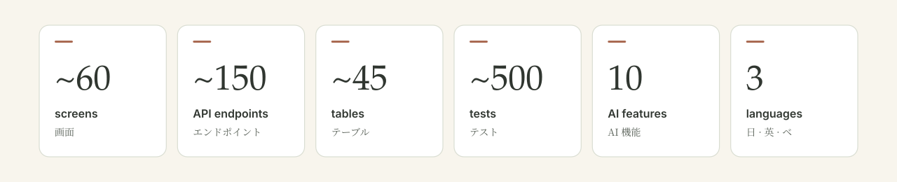

```mermaid
%%{init: {'theme':'base','themeVariables':{'xyChart':{'backgroundColor':'#F8F5ED','titleColor':'#303630','xAxisLabelColor':'#303630','yAxisLabelColor':'#303630','xAxisLineColor':'#81877C','yAxisLineColor':'#81877C','xAxisTickColor':'#81877C','yAxisTickColor':'#81877C','plotColorPalette':'#537257'}}}}%%
xychart-beta
    title "API surface: endpoints per domain"
    x-axis ["Exchanges", "Circles", "Requests", "Users", "Family", "Listings", "Chat", "AI", "Thanks", "Safety", "Events", "Payments", "Assistant", "Ask", "Notices", "Coord."]
    y-axis "Endpoints" 0 --> 24
    bar [21, 17, 15, 12, 12, 10, 9, 8, 8, 8, 7, 6, 5, 5, 5, 4]
```

<table>
<tr>
<td width="50%">

```mermaid
%%{init: {'theme':'base','themeVariables':{'pie1':'#537257','pie2':'#AA6A52','pie3':'#81877C','pieStrokeColor':'#F8F5ED','pieOuterStrokeColor':'#D9DDD2','pieTitleTextColor':'#303630','pieSectionTextColor':'#FFFFFF','pieLegendTextColor':'#303630','fontFamily':'Inter, sans-serif'}}}%%
pie showData
    title Test suite (~500 tests)
    "Backend integration (real Postgres)" : 300
    "Backend unit" : 71
    "Mobile (node:test)" : 126
```

</td>
<td width="50%">

| Metric | Value |
|---|---|
| Screens | ~60 |
| API endpoints | ~150 |
| DB tables | ~45 |
| Alembic migrations | 16 |
| `FOR UPDATE` call sites | 32 |
| Backend test files | 49 |
| Mobile test files | 21 |
| AI features | 10 |
| Languages | ja · en · bn (+ vi content) |

</td>
</tr>
</table>

<sub>The backend split between unit and integration tests is approximate. The backend has about 371 test functions in total.</sub>


## 色 · Design language


<table>
<tr>
<td width="120" align="center"></td>
<td>

- **Calm and readable for seniors.** Body text is 18 pt. Touch targets are 48 dp, and primary controls are 52 dp.
- **Three scripts and three fonts.** Inter, Noto Sans JP and Noto Sans Bengali, with line heights tuned for each script. Lora is used for the wordmark.
- **Accessibility.** Users can set their own text scale and turn on a simple mode. There are about 190 screen-reader labels, and decorative tab icons are hidden from screen readers.
- **Tokens in one place.** Colours and type come from a single [`theme/tokens.json`](mobile/src/theme/tokens.json), the same palette as this README.

</td>
</tr>
</table>


## 道具 · Tech stack

<table>
<tr><th>Layer</th><th>Technology</th></tr>
<tr><td><b>📱 Mobile</b></td><td>Expo SDK 58 · React Native 0.88 · React 19 · Expo Router (typed routes) · React Compiler · NativeWind 4 / Tailwind · Reanimated 4 · i18next</td></tr>
<tr><td><b>🔌 Native</b></td><td>expo-camera (QR) · expo-image-picker · expo-location · expo-audio / speech · expo-notifications · expo-secure-store</td></tr>
<tr><td><b>⚡ API</b></td><td>FastAPI · Pydantic 2 · Uvicorn · SSE</td></tr>
<tr><td><b>🗄️ Data</b></td><td>PostgreSQL 17 · SQLAlchemy 2 (async) · asyncpg · PgBouncer · Alembic</td></tr>
<tr><td><b>🔁 Async</b></td><td>Redis 8 · dramatiq · DB outbox with workers that claim rows using <code>SKIP LOCKED</code></td></tr>
<tr><td><b>🤖 AI</b></td><td>OpenAI Agents SDK · structured outputs · function tools · vision · Whisper</td></tr>
<tr><td><b>🖼️ Media</b></td><td>S3-compatible storage (RustFS) via aiobotocore · Pillow (WebP variants, EXIF stripping, decompression-bomb guard)</td></tr>
<tr><td><b>🔑 Auth</b></td><td>Supabase Auth · JWT verification against JWKS (ES256/RS256)</td></tr>
<tr><td><b>💴 Payments</b></td><td>Stripe (HMAC webhooks, idempotency keys) · bKash / Nagad mocks</td></tr>
<tr><td><b>🐳 Infra</b></td><td>Docker multi-stage build (uv, non-root user) · Docker Compose · Caddy 2 auto-HTTPS</td></tr>
<tr><td><b>✅ Quality</b></td><td>pytest + pytest-asyncio · node:test · Ruff · ESLint · Prettier · pre-commit</td></tr>
</table>


## 始め · Quick start

### Prerequisites

[Docker](https://docs.docker.com/get-docker/), [uv](https://docs.astral.sh/uv/), Node 22+ with [pnpm](https://pnpm.io/), and a Supabase project for auth.

### 1 · Backend and infrastructure

```bash
cd backend
cp .env.example .env.local        # fill in Supabase URL, OpenAI key, etc.
docker compose -f ../compose.yaml up -d postgres pgbouncer redis s3
uv sync
uv run alembic upgrade head
uv run uvicorn main:app --reload  # → http://127.0.0.1:8000/docs
```

To run the whole stack, including the scheduler and push dispatcher, in containers:

```bash
docker compose up -d --build
docker compose --profile worker up -d worker   # optional dramatiq worker
```

### 2 · Mobile

```bash
cd mobile
cp .env.example .env              # EXPO_PUBLIC_API_URL, EXPO_PUBLIC_SUPABASE_URL, EXPO_PUBLIC_SUPABASE_KEY
pnpm install
pnpm start                        # press a for Android, i for iOS
```

> Native modules such as the camera, notifications and audio need an [Expo development build](https://docs.expo.dev/develop/development-builds/introduction/).

### 3 · Production

```bash
cp .env.production.example .env.production   # also set S3_SECRET_KEY, S3_PUBLIC_ENDPOINT_URL, S3_DOMAIN
docker compose -f compose.prod.yaml --env-file .env.production up -d --build
```

The `migrate` service applies the Alembic migrations once. Caddy then requests TLS certificates for `APP_DOMAIN` and `S3_DOMAIN`.


## 試験 · Testing

```mermaid
%%{init: {'theme':'base','themeVariables':{'primaryColor':'#E8EEE2','primaryTextColor':'#303630','primaryBorderColor':'#537257','lineColor':'#81877C','secondaryColor':'#F8F5ED','tertiaryColor':'#FFFFFF','clusterBkg':'#F8F5ED','clusterBorder':'#D9DDD2','fontFamily':'Inter, Noto Sans JP, sans-serif'}}}%%
flowchart LR
    CODE[✏️ change] --> PC{pre-commit}
    PC -->|backend| RUFF[Ruff check + format]
    PC -->|mobile| PRET[Prettier]
    RUFF --> UT[pytest unit<br/>auth · pagination · Stripe sig<br/>media · storage · push]
    UT --> IT[pytest integration<br/>real ASGI app + real Postgres]:::act
    PRET --> TSC["tsc --noEmit"] --> LINT[expo lint] --> NT[node:test<br/>pure state machines]:::act
    IT & NT --> OK([✅ ready to commit]):::clay
    classDef act fill:#537257,stroke:#303630,color:#FFFFFF
    classDef clay fill:#AA6A52,stroke:#AA6A52,color:#F8F5ED
```

```bash
# Backend: unit + integration (needs a migrated Postgres)
cd backend && uv run pytest
uv run pytest -m "not integration"            # unit tests only

# Mobile: pure-logic tests, type check and lint
cd mobile
node --experimental-strip-types --test --experimental-test-isolation=none tests/*.test.mjs
pnpm exec tsc --noEmit
pnpm lint

# Everything (from the repository root)
uvx pre-commit run --all-files                # Ruff + Prettier
```


## 守り · Security & reliability

```mermaid
%%{init: {'theme':'base','themeVariables':{'primaryColor':'#E8EEE2','primaryTextColor':'#303630','primaryBorderColor':'#537257','lineColor':'#81877C','secondaryColor':'#F8F5ED','tertiaryColor':'#FFFFFF','clusterBkg':'#F8F5ED','clusterBorder':'#D9DDD2','fontFamily':'Inter, Noto Sans JP, sans-serif'}}}%%
flowchart LR
    REQ([incoming request]) --> L1
    L1["① Edge<br/>Caddy TLS · 127.0.0.1-bound dev ports"]:::clay --> L2
    L2["② Identity<br/>JWKS-verified JWT · aud check"] --> L3
    L3["③ Abuse<br/>Redis rate limits · Retry-After<br/>AI hourly budgets"] --> L4
    L4["④ Input<br/>Pydantic extra=forbid<br/>15 MB image / 25 MB audio caps<br/>decompression-bomb guard"] --> L5
    L5["⑤ Authorization<br/>circle membership<br/>scoped proxy grants"] --> L6
    L6["⑥ Integrity<br/>FOR UPDATE · SKIP LOCKED<br/>idempotency keys · HMAC webhooks"]:::act --> L7
    L7["⑦ Privacy<br/>EXIF strip · 900 s signed URLs<br/>approximate location · store=False"]:::act
    classDef act fill:#537257,stroke:#303630,color:#FFFFFF
    classDef clay fill:#AA6A52,stroke:#AA6A52,color:#F8F5ED
```

| Concern | How Otagai handles it |
|---|---|
| **Authentication** | Supabase JWTs are verified against a cached JWKS. The audience must be `authenticated`. |
| **Access control** | Each circle has a membership check. Proxy actions require an explicit, scoped, revocable `proxy_grant`. |
| **Race conditions** | 32 `SELECT … FOR UPDATE` row locks, and workers claim jobs with `SKIP LOCKED`, so several replicas can run safely. |
| **Idempotency** | Payments take an `Idempotency-Key`. Reusing a key for a different payment returns `409`. |
| **Webhooks** | Stripe signatures are checked with HMAC, a constant-time comparison and a timestamp tolerance. |
| **LLM safety** | Model output is sanitized and checked against the real category list. Risky categories are forced to help-only. AI never decides liability. |
| **Error handling** | A typed `ServiceError` hierarchy maps each error to an HTTP status and a `request_id`. Retries happen only on transient failures, with backoff. |
| **Containers** | Multi-stage image that runs as non-root UID `10001`. Secrets are stored as `SecretStr`. `/health` and `/ready` probes. |


## 地図 · Repository layout

```text
otagai/
├── mobile/                  # Expo + React Native app (pnpm)
│   ├── src/app/             # Expo Router screens (~60)
│   ├── src/components/      # Shared UI
│   ├── src/lib/             # API clients, state machines, culture packs, i18n
│   ├── src/theme/           # Design tokens and fonts
│   └── tests/               # node:test suites
├── backend/                 # FastAPI service (uv)
│   ├── app/routes/          # ~21 route groups
│   ├── app/services/        # Domain logic, AI, media, notifications, scheduler
│   ├── app/repositories/    # Async data access
│   ├── app/database/        # Models and Alembic migrations
│   ├── docs/                # API, auth, DB, deployment and testing docs
│   └── tests/               # Unit and integration tests
├── deploy/Caddyfile         # Edge proxy and TLS
├── compose.yaml             # Local stack
├── compose.prod.yaml        # Production stack
└── docs/                    # Product proposal, flow specs and README assets
```

📚 More detail: [backend docs](backend/docs/) · [product proposal](docs/) · [family consent](docs/family-consent.md) · [neighbour flows](docs/neighbour-flows.md) · [push setup](docs/request-push-setup.md)

## 道 · Roadmap

- [ ] Use the guided Ask API in the mobile Ask screens, which currently use local templates
- [ ] Run end-to-end acceptance tests on iOS devices
- [ ] Add a CI pipeline (GitHub Actions: Ruff, pytest, tsc, lint)
- [ ] Search tools semantically with embeddings
- [ ] Expand culture packs to more regions

## 仲間 · Team

Built for the hackathon on the **繋ぐ _Tsunagu_** (connection) theme by
[**@Hemalv02**](https://github.com/Hemalv02) · [**@shyan23**](https://github.com/shyan23) · **fahim** · **mithunvoe**

<div align="center">
<br/>

<br/>
<sub><b>お互いさま</b>: we're all in this together.</sub>
</div>
