# 図録 · Original diagram catalogue

[Project overview](../README.md) · [Current architecture guide](architecture.md)

All 33 Mermaid diagrams from the original README are preserved here. They reflect the original documentation snapshot, including its workflow descriptions and counts. For the current design, see the architecture guide and the [redesigned AI pipeline](../diagrams/otagai-ai-complete-pipeline.png).

## 暮らし · Product and journey

### Problem and product response

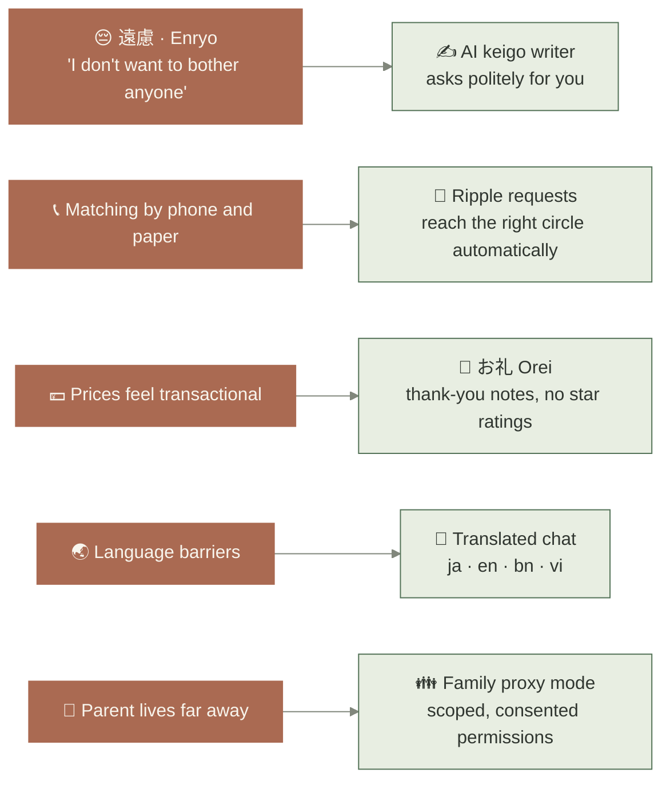
```mermaid
%%{init: {'theme':'base','themeVariables':{'primaryColor':'#E8EEE2','primaryTextColor':'#303630','primaryBorderColor':'#537257','lineColor':'#81877C','secondaryColor':'#F8F5ED','tertiaryColor':'#FFFFFF','fontFamily':'Inter, Noto Sans JP, sans-serif'}}}%%
flowchart LR
    P1["😔 遠慮 · Enryo<br/>'I don't want to bother anyone'"]:::clay --> S1["✍️ AI keigo writer<br/>asks politely for you"]
    P2["📞 Matching by phone and paper"]:::clay --> S2["🌊 Ripple requests<br/>reach the right circle automatically"]
    P3["💴 Prices feel transactional"]:::clay --> S3["🙏 お礼 Orei<br/>thank-you notes, no star ratings"]
    P4["🌏 Language barriers"]:::clay --> S4["💬 Translated chat<br/>ja · en · bn · vi"]
    P5["👵 Parent lives far away"]:::clay --> S5["👪 Family proxy mode<br/>scoped, consented permissions"]
    classDef clay fill:#AA6A52,stroke:#AA6A52,color:#F8F5ED
```

### Feature map

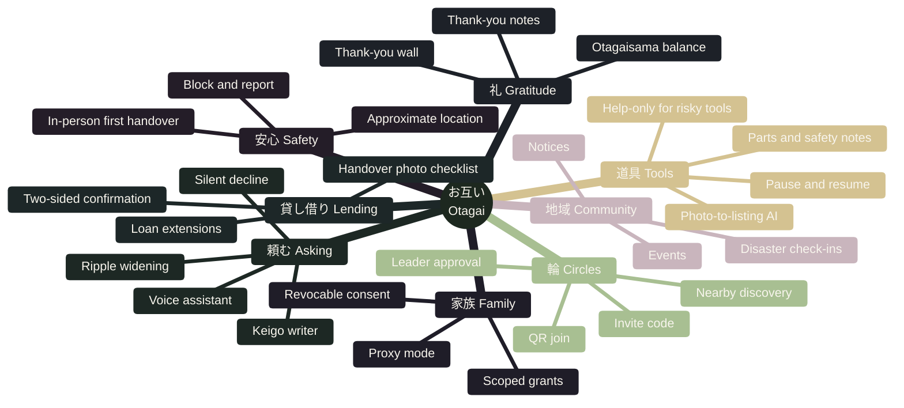
```mermaid
%%{init: {'theme':'base','themeVariables':{'primaryColor':'#537257','primaryTextColor':'#F8F5ED','primaryBorderColor':'#303630','lineColor':'#81877C','secondaryColor':'#E8EEE2','tertiaryColor':'#F8F5ED','fontFamily':'Inter, Noto Sans JP, sans-serif'}}}%%
mindmap
  root((お互い<br/>Otagai))
    輪 Circles
      Invite code
      QR join
      Nearby discovery
      Leader approval
    道具 Tools
      Photo-to-listing AI
      Parts and safety notes
      Pause and resume
      Help-only for risky tools
    頼む Asking
      Keigo writer
      Voice assistant
      Ripple widening
      Silent decline
    貸し借り Lending
      Handover photo checklist
      Loan extensions
      Two-sided confirmation
    礼 Gratitude
      Thank-you notes
      Otagaisama balance
      Thank-you wall
    家族 Family
      Proxy mode
      Scoped grants
      Revocable consent
    安心 Safety
      Block and report
      Approximate location
      In-person first handover
    地域 Community
      Notices
      Events
      Disaster check-ins
```

### A day with Otagai

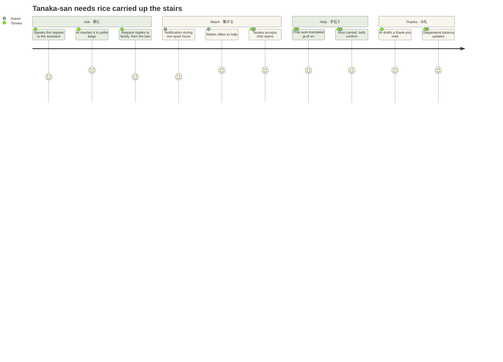
```mermaid
%%{init: {'theme':'base','themeVariables':{'primaryColor':'#E8EEE2','primaryTextColor':'#303630','primaryBorderColor':'#537257','lineColor':'#81877C','secondaryColor':'#F8F5ED','tertiaryColor':'#FFFFFF','fontFamily':'Inter, Noto Sans JP, sans-serif','fillType0':'#E8EEE2','fillType1':'#F8F5ED','fillType2':'#E8EEE2','fillType3':'#F8F5ED','actor0':'#537257','actor1':'#AA6A52','actor2':'#586057'}}}%%
journey
    title Tanaka-san needs rice carried up the stairs
    section Ask · 頼む
      Speaks the request to the assistant: 4: Tanaka
      AI rewrites it in polite keigo: 5: Tanaka
      Request ripples to family, then the han: 4: Tanaka
    section Match · 繋がる
      Notification during non-quiet hours: 4: Rahim
      Rahim offers to help: 5: Rahim
      Tanaka accepts, chat opens: 5: Tanaka, Rahim
    section Help · 手伝う
      Chat auto-translated ja ⇄ en: 5: Tanaka, Rahim
      Rice carried, both confirm: 5: Tanaka, Rahim
    section Thanks · お礼
      AI drafts a thank-you note: 5: Tanaka
      Otagaisama balance updates: 5: Tanaka, Rahim
```

## 設計 · System architecture

### Mobile route tree

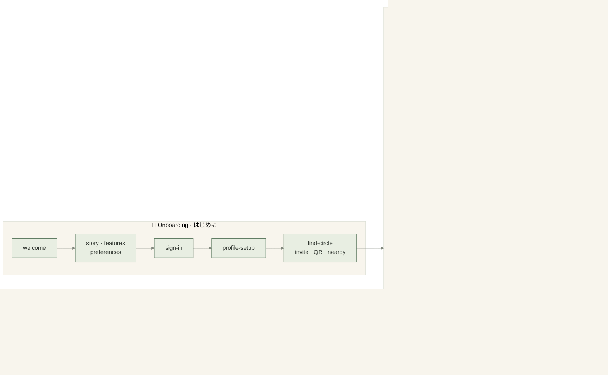
```mermaid
%%{init: {'theme':'base','themeVariables':{'primaryColor':'#E8EEE2','primaryTextColor':'#303630','primaryBorderColor':'#537257','lineColor':'#81877C','secondaryColor':'#F8F5ED','tertiaryColor':'#FFFFFF','clusterBkg':'#F8F5ED','clusterBorder':'#D9DDD2','fontFamily':'Inter, Noto Sans JP, sans-serif'}}}%%
flowchart LR
    subgraph Onboarding["🚪 Onboarding · はじめに"]
        W[welcome] --> OS[story · features<br/>preferences] --> SI[sign-in] --> PS[profile-setup] --> FC[find-circle<br/>invite · QR · nearby]
    end

    subgraph Tabs["📱 (community)/(tabs)"]
        H[🏠 Home · today]:::act
        T[🧰 Tools · browse]:::act
        R[🌊 Requests]:::act
        A[🤖 Assistant]:::act
    end

    subgraph Stacks["Feature stacks"]
        L[tools/add · tools/id<br/>my-listings]
        ASK[ask → clarify →<br/>suggestions → review]
        EX[exchanges/id<br/>chat · pickup · complete · thank-you]
        LO[loans/id<br/>pickup · messages · thank-you]
        FAM[family · link<br/>permissions · ask-for]
        SAF[neighbours · report-or-block<br/>thank-you-wall]
        NT[notifications<br/>preferences]
    end

    FC --> Tabs
    T --> L
    R --> ASK
    A --> ASK
    H --> EX & LO & NT
    Tabs --> FAM & SAF
    classDef act fill:#537257,stroke:#303630,color:#FFFFFF
```

### Mobile internal layers

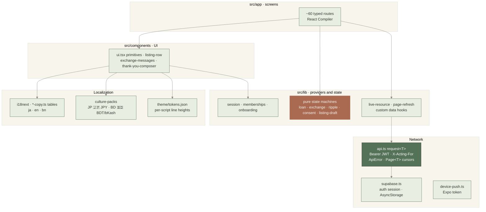
```mermaid
%%{init: {'theme':'base','themeVariables':{'primaryColor':'#E8EEE2','primaryTextColor':'#303630','primaryBorderColor':'#537257','lineColor':'#81877C','secondaryColor':'#F8F5ED','tertiaryColor':'#FFFFFF','clusterBkg':'#F8F5ED','clusterBorder':'#D9DDD2','fontFamily':'Inter, Noto Sans JP, sans-serif'}}}%%
flowchart TB
    subgraph Screens["src/app · screens"]
        SC[~60 typed routes<br/>React Compiler]
    end
    subgraph UI["src/components · UI"]
        CMP[ui.tsx primitives · listing-row<br/>exchange-messages · thank-you-composer]
    end
    subgraph State["src/lib · providers and state"]
        PRV[session · memberships · onboarding]
        SM[pure state machines<br/>loan · exchange · ripple · consent · listing-draft]:::clay
        LRS[live-resource · page-refresh<br/>custom data hooks]
    end
    subgraph Locale["Localization"]
        I18N[i18next · *-copy.ts tables<br/>ja · en · bn]
        CP[culture-packs<br/>JP 🇯🇵 JPY · BD 🇧🇩 BDT/bKash]
        TH[theme/tokens.json<br/>per-script line heights]
    end
    subgraph Net["Network"]
        API["api.ts request&lt;T&gt;<br/>Bearer JWT · X-Acting-For<br/>ApiError · Page&lt;T&gt; cursors"]:::act
        SB[supabase.ts<br/>auth session · AsyncStorage]
        PUSH[device-push.ts<br/>Expo token]
    end
    SC --> CMP --> PRV
    SC --> LRS --> API
    SC --> SM
    CMP --> I18N & CP & TH
    API --> SB
    classDef act fill:#537257,stroke:#303630,color:#FFFFFF
    classDef clay fill:#AA6A52,stroke:#AA6A52,color:#F8F5ED
```

### FastAPI layers

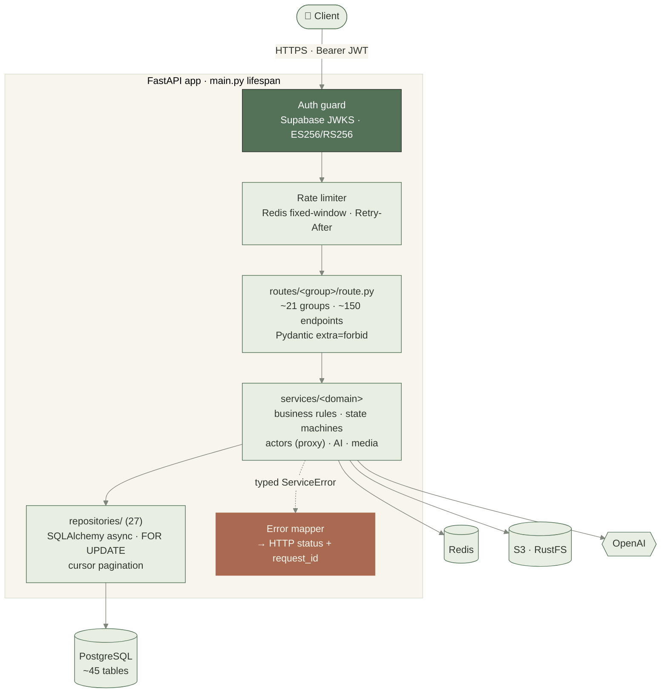
```mermaid
%%{init: {'theme':'base','themeVariables':{'primaryColor':'#E8EEE2','primaryTextColor':'#303630','primaryBorderColor':'#537257','lineColor':'#81877C','secondaryColor':'#F8F5ED','tertiaryColor':'#FFFFFF','clusterBkg':'#F8F5ED','clusterBorder':'#D9DDD2','fontFamily':'Inter, Noto Sans JP, sans-serif'}}}%%
flowchart TB
    C([📱 Client]) -->|HTTPS · Bearer JWT| MW
    subgraph App["FastAPI app · main.py lifespan"]
        MW["Auth guard<br/>Supabase JWKS · ES256/RS256"]:::act --> RL["Rate limiter<br/>Redis fixed-window · Retry-After"]
        RL --> RT["routes/&lt;group&gt;/route.py<br/>~21 groups · ~150 endpoints<br/>Pydantic extra=forbid"]
        RT --> SV["services/&lt;domain&gt;<br/>business rules · state machines<br/>actors (proxy) · AI · media"]
        SV --> RP["repositories/ (27)<br/>SQLAlchemy async · FOR UPDATE<br/>cursor pagination"]
        SV -. typed ServiceError .-> EM["Error mapper<br/>→ HTTP status + request_id"]:::clay
    end
    RP --> PG[(PostgreSQL<br/>~45 tables)]
    SV --> RD[(Redis)]
    SV --> S3[(S3 · RustFS)]
    SV --> OAI{{OpenAI}}
    classDef act fill:#537257,stroke:#303630,color:#FFFFFF
    classDef clay fill:#AA6A52,stroke:#AA6A52,color:#F8F5ED
```

### Life of an API request

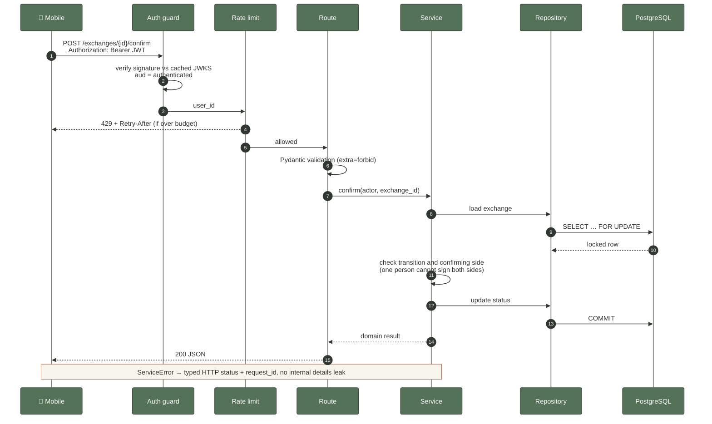
```mermaid
%%{init: {'theme':'base','themeVariables':{'actorBkg':'#537257','actorTextColor':'#FFFFFF','actorBorder':'#303630','actorLineColor':'#81877C','signalColor':'#303630','signalTextColor':'#303630','labelBoxBkgColor':'#E8EEE2','labelBoxBorderColor':'#537257','loopTextColor':'#303630','noteBkgColor':'#F8F5ED','noteBorderColor':'#AA6A52','noteTextColor':'#303630','activationBkgColor':'#E8EEE2','activationBorderColor':'#537257','fontFamily':'Inter, Noto Sans JP, sans-serif'}}}%%
sequenceDiagram
    autonumber
    participant M as 📱 Mobile
    participant G as Auth guard
    participant L as Rate limit
    participant R as Route
    participant S as Service
    participant D as Repository
    participant P as PostgreSQL
    M->>G: POST /exchanges/{id}/confirm<br/>Authorization: Bearer JWT
    G->>G: verify signature vs cached JWKS<br/>aud = authenticated
    G->>L: user_id
    L-->>M: 429 + Retry-After (if over budget)
    L->>R: allowed
    R->>R: Pydantic validation (extra=forbid)
    R->>S: confirm(actor, exchange_id)
    S->>D: load exchange
    D->>P: SELECT … FOR UPDATE
    P-->>D: locked row
    S->>S: check transition and confirming side<br/>(one person cannot sign both sides)
    S->>D: update status
    D->>P: COMMIT
    S-->>R: domain result
    R-->>M: 200 JSON
    Note over S,M: ServiceError → typed HTTP status + request_id, no internal details leak
```

### Original AI pipeline

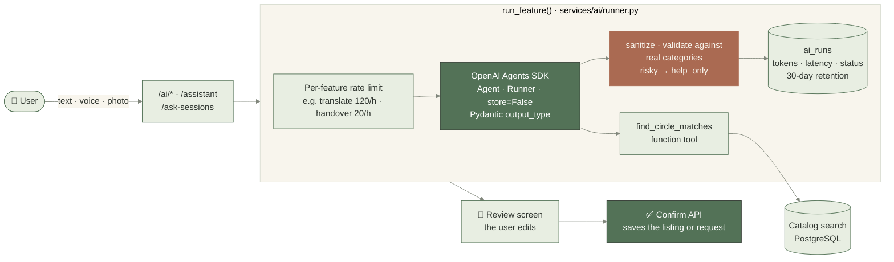
```mermaid
%%{init: {'theme':'base','themeVariables':{'primaryColor':'#E8EEE2','primaryTextColor':'#303630','primaryBorderColor':'#537257','lineColor':'#81877C','secondaryColor':'#F8F5ED','tertiaryColor':'#FFFFFF','clusterBkg':'#F8F5ED','clusterBorder':'#D9DDD2','fontFamily':'Inter, Noto Sans JP, sans-serif'}}}%%
flowchart LR
    U([👤 User]) -->|text · voice · photo| EP["/ai/* · /assistant<br/>/ask-sessions"]
    EP --> RUN
    subgraph RUN["run_feature() · services/ai/runner.py"]
        direction TB
        LIM["Per-feature rate limit<br/>e.g. translate 120/h · handover 20/h"] --> AG["OpenAI Agents SDK<br/>Agent · Runner · store=False<br/>Pydantic output_type"]:::act
        AG --> TOOL["find_circle_matches<br/>function tool"]
        AG --> SAN["sanitize · validate against<br/>real categories<br/>risky → help_only"]:::clay
        SAN --> LOG[("ai_runs<br/>tokens · latency · status<br/>30-day retention")]
    end
    TOOL --> DB[(Catalog search<br/>PostgreSQL)]
    RUN --> REV["📱 Review screen<br/>the user edits"] --> CONF["✅ Confirm API<br/>saves the listing or request"]:::act
    classDef act fill:#537257,stroke:#303630,color:#FFFFFF
    classDef clay fill:#AA6A52,stroke:#AA6A52,color:#F8F5ED
```

### Core data model

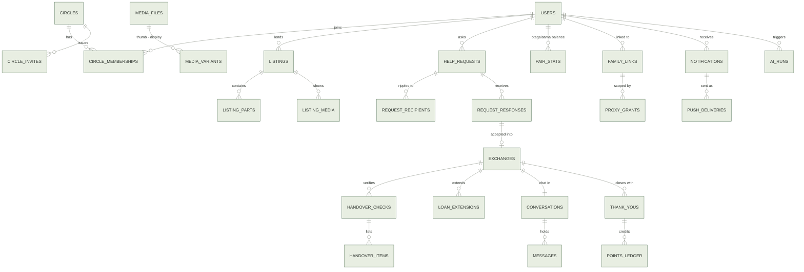
```mermaid
%%{init: {'theme':'base','themeVariables':{'primaryColor':'#E8EEE2','primaryTextColor':'#303630','primaryBorderColor':'#537257','lineColor':'#81877C','secondaryColor':'#F8F5ED','tertiaryColor':'#FFFFFF','fontFamily':'Inter, Noto Sans JP, sans-serif'}}}%%
erDiagram
    USERS ||--o{ CIRCLE_MEMBERSHIPS : joins
    CIRCLES ||--o{ CIRCLE_MEMBERSHIPS : has
    CIRCLES ||--o{ CIRCLE_INVITES : issues
    USERS ||--o{ LISTINGS : lends
    LISTINGS ||--o{ LISTING_PARTS : contains
    LISTINGS ||--o{ LISTING_MEDIA : shows
    MEDIA_FILES ||--o{ MEDIA_VARIANTS : "thumb · display"
    USERS ||--o{ HELP_REQUESTS : asks
    HELP_REQUESTS ||--o{ REQUEST_RECIPIENTS : "ripples to"
    HELP_REQUESTS ||--o{ REQUEST_RESPONSES : receives
    REQUEST_RESPONSES ||--o| EXCHANGES : "accepted into"
    EXCHANGES ||--o{ HANDOVER_CHECKS : verifies
    HANDOVER_CHECKS ||--o{ HANDOVER_ITEMS : lists
    EXCHANGES ||--o{ LOAN_EXTENSIONS : extends
    EXCHANGES ||--|| CONVERSATIONS : "chat in"
    CONVERSATIONS ||--o{ MESSAGES : holds
    EXCHANGES ||--o{ THANK_YOUS : "closes with"
    THANK_YOUS ||--o{ POINTS_LEDGER : credits
    USERS ||--o{ PAIR_STATS : "otagaisama balance"
    USERS ||--o{ FAMILY_LINKS : "linked to"
    FAMILY_LINKS ||--o{ PROXY_GRANTS : "scoped by"
    USERS ||--o{ NOTIFICATIONS : receives
    NOTIFICATIONS ||--o{ PUSH_DELIVERIES : "sent as"
    USERS ||--o{ AI_RUNS : triggers
```

### Data model by domain

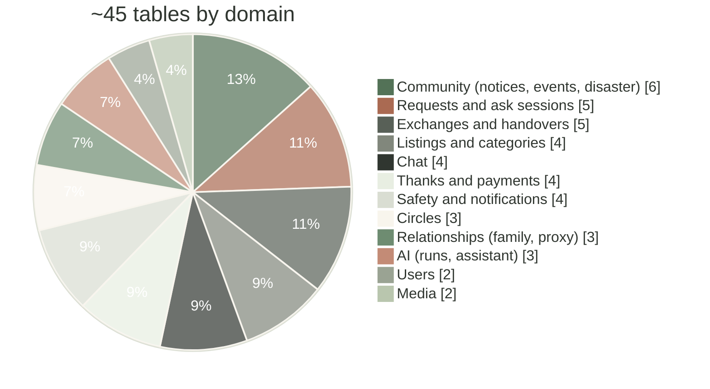
```mermaid
%%{init: {'theme':'base','themeVariables':{'pie1':'#537257','pie2':'#AA6A52','pie3':'#586057','pie4':'#81877C','pie5':'#303630','pie6':'#E8EEE2','pie7':'#D9DDD2','pie8':'#F8F5ED','pie9':'#6E8C71','pie10':'#C38B76','pie11':'#9AA393','pie12':'#B9C6AE','pieStrokeColor':'#F8F5ED','pieOuterStrokeColor':'#D9DDD2','pieTitleTextColor':'#303630','pieSectionTextColor':'#FFFFFF','pieLegendTextColor':'#303630','fontFamily':'Inter, Noto Sans JP, sans-serif'}}}%%
pie showData
    title ~45 tables by domain
    "Community (notices, events, disaster)" : 6
    "Requests and ask sessions" : 5
    "Exchanges and handovers" : 5
    "Listings and categories" : 4
    "Chat" : 4
    "Thanks and payments" : 4
    "Safety and notifications" : 4
    "Circles" : 3
    "Relationships (family, proxy)" : 3
    "AI (runs, assistant)" : 3
    "Users" : 2
    "Media" : 2
```

### Ripple timeline

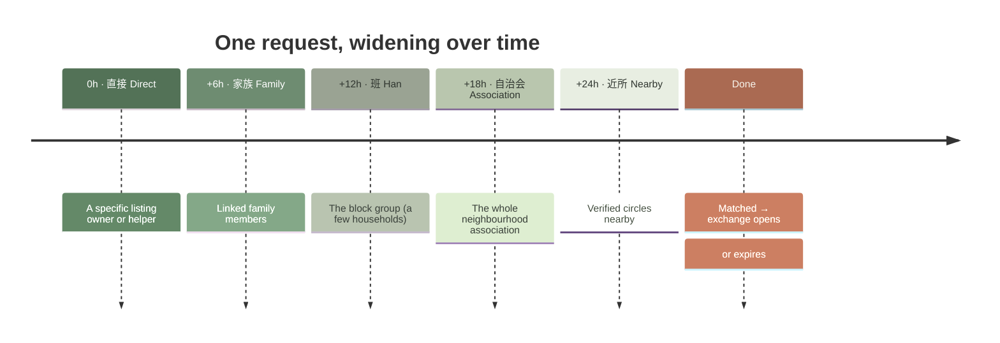
```mermaid
%%{init: {'theme':'base','themeVariables':{'cScale0':'#537257','cScaleLabel0':'#FFFFFF','cScale1':'#6E8C71','cScaleLabel1':'#FFFFFF','cScale2':'#9AA393','cScaleLabel2':'#303630','cScale3':'#B9C6AE','cScaleLabel3':'#303630','cScale4':'#E8EEE2','cScaleLabel4':'#303630','cScale5':'#AA6A52','cScaleLabel5':'#F8F5ED','fontFamily':'Inter, Noto Sans JP, sans-serif'}}}%%
timeline
    title One request, widening over time
    0h  · 直接 Direct : A specific listing owner or helper
    +6h · 家族 Family : Linked family members
    +12h · 班 Han : The block group (a few households)
    +18h · 自治会 Association : The whole neighbourhood association
    +24h · 近所 Nearby : Verified circles nearby
    Done : Matched → exchange opens : or expires
```

### Ripple sequence

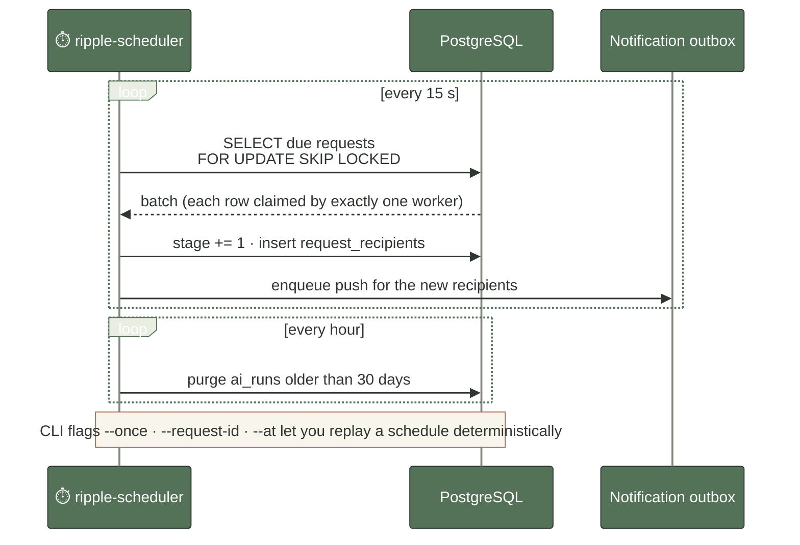
```mermaid
%%{init: {'theme':'base','themeVariables':{'actorBkg':'#537257','actorTextColor':'#FFFFFF','actorBorder':'#303630','actorLineColor':'#81877C','signalColor':'#303630','signalTextColor':'#303630','labelBoxBkgColor':'#E8EEE2','labelBoxBorderColor':'#537257','loopTextColor':'#303630','noteBkgColor':'#F8F5ED','noteBorderColor':'#AA6A52','noteTextColor':'#303630','fontFamily':'Inter, Noto Sans JP, sans-serif'}}}%%
sequenceDiagram
    participant SCH as ⏱️ ripple-scheduler
    participant DB as PostgreSQL
    participant OUT as Notification outbox
    loop every 15 s
        SCH->>DB: SELECT due requests<br/>FOR UPDATE SKIP LOCKED
        DB-->>SCH: batch (each row claimed by exactly one worker)
        SCH->>DB: stage += 1 · insert request_recipients
        SCH->>OUT: enqueue push for the new recipients
    end
    loop every hour
        SCH->>DB: purge ai_runs older than 30 days
    end
    Note over SCH,DB: CLI flags --once · --request-id · --at let you replay a schedule deterministically
```

### Background workers

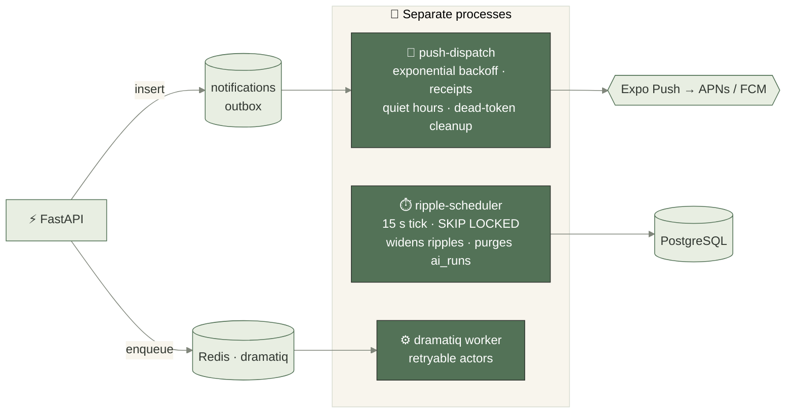
```mermaid
%%{init: {'theme':'base','themeVariables':{'primaryColor':'#E8EEE2','primaryTextColor':'#303630','primaryBorderColor':'#537257','lineColor':'#81877C','secondaryColor':'#F8F5ED','tertiaryColor':'#FFFFFF','clusterBkg':'#F8F5ED','clusterBorder':'#D9DDD2','fontFamily':'Inter, Noto Sans JP, sans-serif'}}}%%
flowchart LR
    API[⚡ FastAPI] -->|insert| OUT[(notifications<br/>outbox)]
    API -->|enqueue| Q[(Redis · dramatiq)]
    subgraph Workers["🔁 Separate processes"]
        SCH["⏱️ ripple-scheduler<br/>15 s tick · SKIP LOCKED<br/>widens ripples · purges ai_runs"]:::act
        PD["🔔 push-dispatch<br/>exponential backoff · receipts<br/>quiet hours · dead-token cleanup"]:::act
        WK["⚙️ dramatiq worker<br/>retryable actors"]:::act
    end
    SCH --> PG[(PostgreSQL)]
    OUT --> PD --> EXPO{{Expo Push → APNs / FCM}}
    Q --> WK
    classDef act fill:#537257,stroke:#303630,color:#FFFFFF
```

### Local development stack

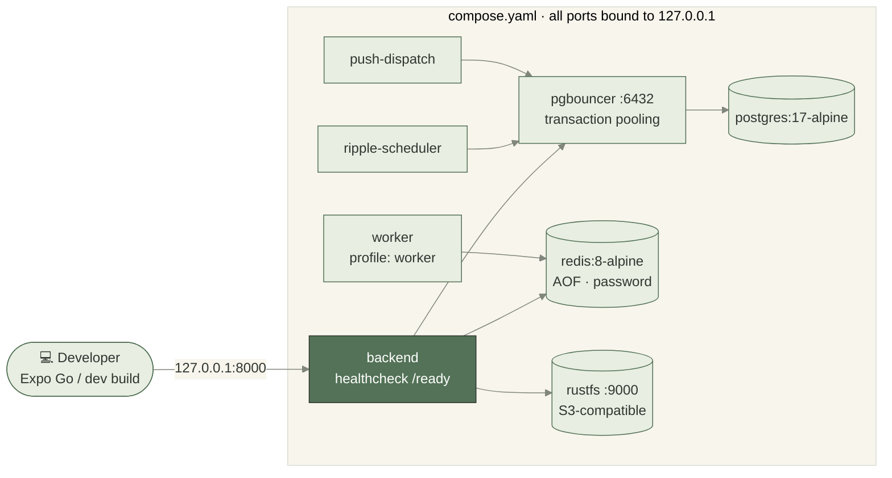
```mermaid
%%{init: {'theme':'base','themeVariables':{'primaryColor':'#E8EEE2','primaryTextColor':'#303630','primaryBorderColor':'#537257','lineColor':'#81877C','secondaryColor':'#F8F5ED','tertiaryColor':'#FFFFFF','clusterBkg':'#F8F5ED','clusterBorder':'#D9DDD2','fontFamily':'Inter, Noto Sans JP, sans-serif'}}}%%
flowchart LR
    DEV([💻 Developer<br/>Expo Go / dev build]) -->|127.0.0.1:8000| BE
    subgraph Compose["compose.yaml · all ports bound to 127.0.0.1"]
        BE[backend<br/>healthcheck /ready]:::act
        SCH[ripple-scheduler]
        PD[push-dispatch]
        WK[worker<br/>profile: worker]
        PGB[pgbouncer :6432<br/>transaction pooling]
        PG[(postgres:17-alpine)]
        RD[(redis:8-alpine<br/>AOF · password)]
        S3[(rustfs :9000<br/>S3-compatible)]
    end
    BE & SCH & PD --> PGB --> PG
    BE & WK --> RD
    BE --> S3
    classDef act fill:#537257,stroke:#303630,color:#FFFFFF
```

### Production deployment

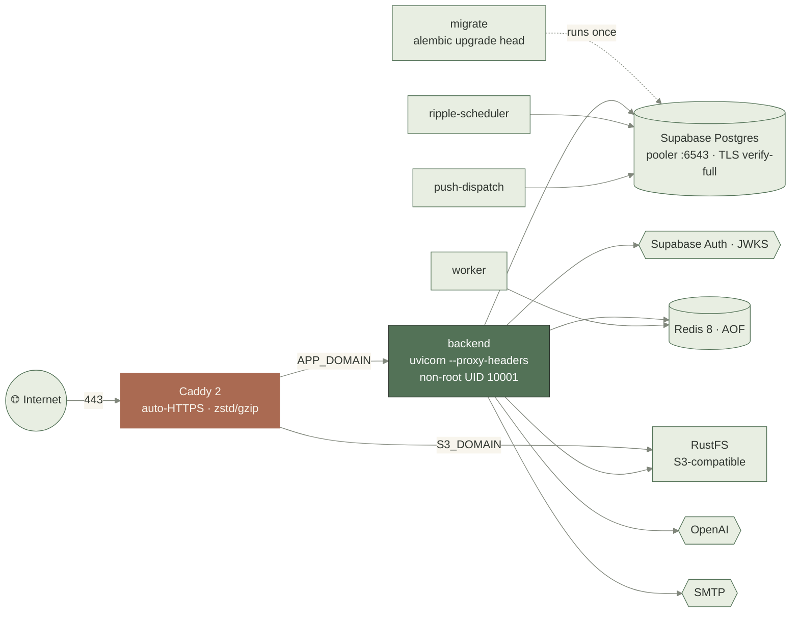
```mermaid
%%{init: {'theme':'base','themeVariables':{'primaryColor':'#E8EEE2','primaryTextColor':'#303630','primaryBorderColor':'#537257','lineColor':'#81877C','secondaryColor':'#F8F5ED','tertiaryColor':'#FFFFFF','clusterBkg':'#F8F5ED','clusterBorder':'#D9DDD2','fontFamily':'Inter, Noto Sans JP, sans-serif'}}}%%
flowchart LR
    NET((🌐 Internet)) -->|443| CADDY["Caddy 2<br/>auto-HTTPS · zstd/gzip"]:::clay
    CADDY -->|APP_DOMAIN| BE["backend<br/>uvicorn --proxy-headers<br/>non-root UID 10001"]:::act
    CADDY -->|S3_DOMAIN| S3["RustFS<br/>S3-compatible"]
    MIG["migrate<br/>alembic upgrade head"] -. runs once .-> SPG
    BE --> SPG[("Supabase Postgres<br/>pooler :6543 · TLS verify-full")]
    BE --> SAUTH{{Supabase Auth · JWKS}}
    BE --> REDIS[(Redis 8 · AOF)]
    BE --> S3
    BE --> OAI{{OpenAI}}
    BE --> SMTP{{SMTP}}
    SCH[ripple-scheduler] --> SPG
    PD[push-dispatch] --> SPG
    WK[worker] --> REDIS
    classDef act fill:#537257,stroke:#303630,color:#FFFFFF
    classDef clay fill:#AA6A52,stroke:#AA6A52,color:#F8F5ED
```

## 流れ · User and delivery flows

### Photo to listing

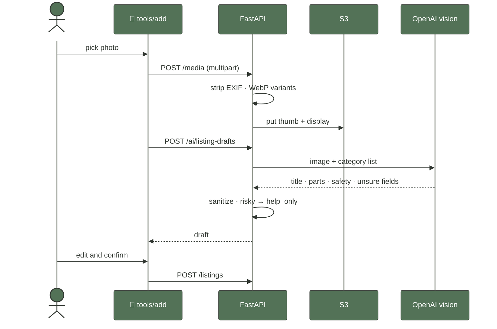
```mermaid
%%{init: {'theme':'base','themeVariables':{'actorBkg':'#537257','actorTextColor':'#FFFFFF','actorBorder':'#303630','actorLineColor':'#81877C','signalColor':'#303630','signalTextColor':'#303630','noteBkgColor':'#F8F5ED','noteBorderColor':'#AA6A52','noteTextColor':'#303630','fontFamily':'Inter, Noto Sans JP, sans-serif'}}}%%
sequenceDiagram
    actor O as Owner
    participant M as 📱 tools/add
    participant API as FastAPI
    participant S3 as S3
    participant AI as OpenAI vision
    O->>M: pick photo
    M->>API: POST /media (multipart)
    API->>API: strip EXIF · WebP variants
    API->>S3: put thumb + display
    M->>API: POST /ai/listing-drafts
    API->>AI: image + category list
    AI-->>API: title · parts · safety · unsure fields
    API->>API: sanitize · risky → help_only
    API-->>M: draft
    O->>M: edit and confirm
    M->>API: POST /listings
```

### Borrowing from request to thank-you

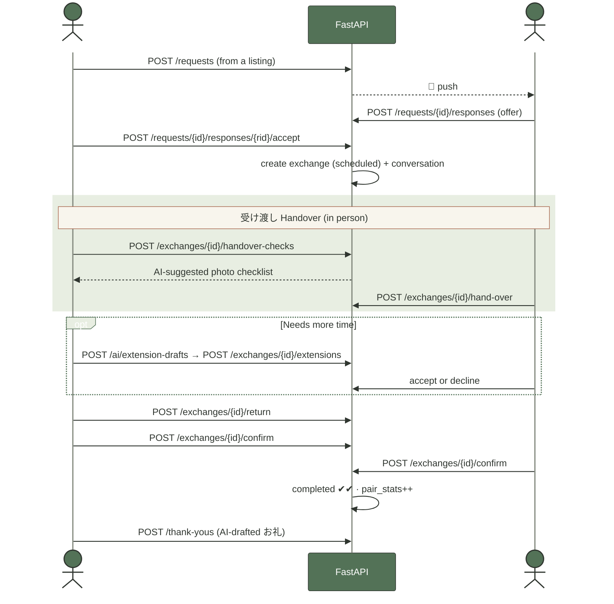
```mermaid
%%{init: {'theme':'base','themeVariables':{'actorBkg':'#537257','actorTextColor':'#FFFFFF','actorBorder':'#303630','actorLineColor':'#81877C','signalColor':'#303630','signalTextColor':'#303630','labelBoxBkgColor':'#E8EEE2','labelBoxBorderColor':'#537257','loopTextColor':'#303630','noteBkgColor':'#F8F5ED','noteBorderColor':'#AA6A52','noteTextColor':'#303630','fontFamily':'Inter, Noto Sans JP, sans-serif'}}}%%
sequenceDiagram
    actor B as Borrower
    participant API as FastAPI
    actor L as Lender
    B->>API: POST /requests (from a listing)
    API-->>L: 🔔 push
    L->>API: POST /requests/{id}/responses (offer)
    B->>API: POST /requests/{id}/responses/{rid}/accept
    API->>API: create exchange (scheduled) + conversation
    rect rgb(232, 238, 226)
    note over B,L: 受け渡し Handover (in person)
    B->>API: POST /exchanges/{id}/handover-checks
    API-->>B: AI-suggested photo checklist
    L->>API: POST /exchanges/{id}/hand-over
    end
    opt Needs more time
    B->>API: POST /ai/extension-drafts → POST /exchanges/{id}/extensions
    L->>API: accept or decline
    end
    B->>API: POST /exchanges/{id}/return
    B->>API: POST /exchanges/{id}/confirm
    L->>API: POST /exchanges/{id}/confirm
    API->>API: completed ✔✔ · pair_stats++
    B->>API: POST /thank-yous (AI-drafted お礼)
```

### Family proxy consent

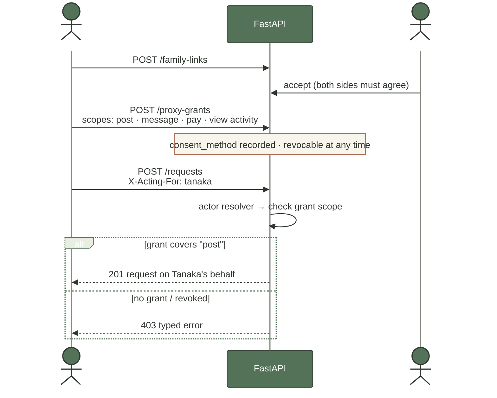
```mermaid
%%{init: {'theme':'base','themeVariables':{'actorBkg':'#537257','actorTextColor':'#FFFFFF','actorBorder':'#303630','actorLineColor':'#81877C','signalColor':'#303630','signalTextColor':'#303630','labelBoxBkgColor':'#E8EEE2','labelBoxBorderColor':'#537257','loopTextColor':'#303630','noteBkgColor':'#F8F5ED','noteBorderColor':'#AA6A52','noteTextColor':'#303630','fontFamily':'Inter, Noto Sans JP, sans-serif'}}}%%
sequenceDiagram
    actor D as Daughter (Fukuoka)
    participant API as FastAPI
    actor T as Tanaka-san
    D->>API: POST /family-links
    T->>API: accept (both sides must agree)
    D->>API: POST /proxy-grants<br/>scopes: post · message · pay · view activity
    Note over API: consent_method recorded · revocable at any time
    D->>API: POST /requests<br/>X-Acting-For: tanaka
    API->>API: actor resolver → check grant scope
    alt grant covers "post"
        API-->>D: 201 request on Tanaka's behalf
    else no grant / revoked
        API-->>D: 403 typed error
    end
```

### Chat and translation

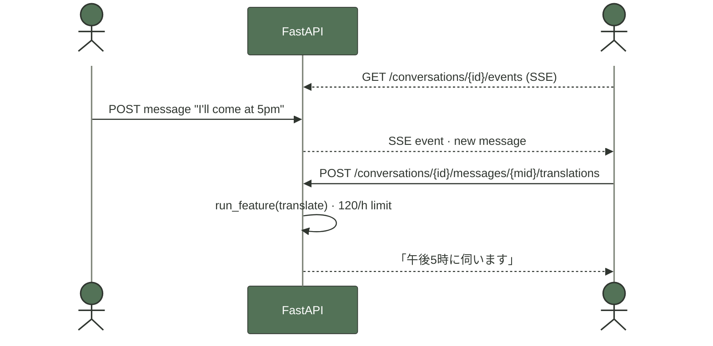
```mermaid
%%{init: {'theme':'base','themeVariables':{'actorBkg':'#537257','actorTextColor':'#FFFFFF','actorBorder':'#303630','actorLineColor':'#81877C','signalColor':'#303630','signalTextColor':'#303630','noteBkgColor':'#F8F5ED','noteBorderColor':'#AA6A52','noteTextColor':'#303630','fontFamily':'Inter, Noto Sans JP, sans-serif'}}}%%
sequenceDiagram
    actor R as Rahim (en)
    participant API as FastAPI
    actor T as Tanaka (ja)
    T-->>API: GET /conversations/{id}/events (SSE)
    R->>API: POST message "I'll come at 5pm"
    API-->>T: SSE event · new message
    T->>API: POST /conversations/{id}/messages/{mid}/translations
    API->>API: run_feature(translate) · 120/h limit
    API-->>T: 「午後5時に伺います」
```

### Push delivery

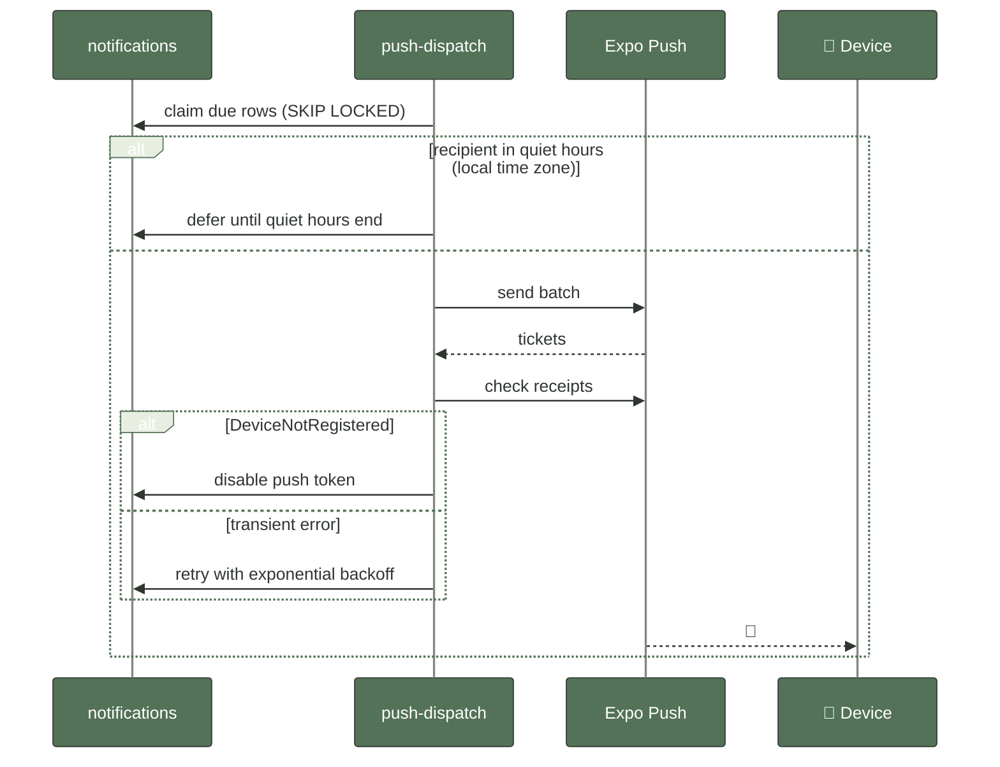
```mermaid
%%{init: {'theme':'base','themeVariables':{'actorBkg':'#537257','actorTextColor':'#FFFFFF','actorBorder':'#303630','actorLineColor':'#81877C','signalColor':'#303630','signalTextColor':'#303630','labelBoxBkgColor':'#E8EEE2','labelBoxBorderColor':'#537257','loopTextColor':'#303630','noteBkgColor':'#F8F5ED','noteBorderColor':'#AA6A52','noteTextColor':'#303630','fontFamily':'Inter, Noto Sans JP, sans-serif'}}}%%
sequenceDiagram
    participant OUT as notifications
    participant PD as push-dispatch
    participant EX as Expo Push
    participant PH as 📱 Device
    PD->>OUT: claim due rows (SKIP LOCKED)
    alt recipient in quiet hours (local time zone)
        PD->>OUT: defer until quiet hours end
    else
        PD->>EX: send batch
        EX-->>PD: tickets
        PD->>EX: check receipts
        alt DeviceNotRegistered
            PD->>OUT: disable push token
        else transient error
            PD->>OUT: retry with exponential backoff
        end
        EX-->>PH: 🔔
    end
```

## 状態 · State machines

### Exchange

```mermaid
%%{init: {'theme':'base','themeVariables':{'primaryColor':'#E8EEE2','primaryTextColor':'#303630','primaryBorderColor':'#537257','lineColor':'#81877C','fontFamily':'Inter, sans-serif'}}}%%
stateDiagram-v2
    [*] --> scheduled
    scheduled --> active: hand-over
    scheduled --> cancelled
    active --> returned: return
    returned --> completed: both confirm ✔✔
    active --> disputed
    returned --> disputed
    completed --> [*]
```

### Help request

```mermaid
%%{init: {'theme':'base','themeVariables':{'primaryColor':'#E8EEE2','primaryTextColor':'#303630','primaryBorderColor':'#537257','lineColor':'#81877C','fontFamily':'Inter, sans-serif'}}}%%
stateDiagram-v2
    [*] --> open
    open --> matched: response accepted
    open --> expired: ripple exhausted
    open --> cancelled
    matched --> in_progress
    in_progress --> done
    done --> [*]
```

### Response

```mermaid
%%{init: {'theme':'base','themeVariables':{'primaryColor':'#E8EEE2','primaryTextColor':'#303630','primaryBorderColor':'#537257','lineColor':'#81877C','fontFamily':'Inter, sans-serif'}}}%%
stateDiagram-v2
    [*] --> pending
    pending --> accepted
    pending --> superseded: another accepted
    pending --> withdrawn
    pending --> expired
```

### Listing

```mermaid
%%{init: {'theme':'base','themeVariables':{'primaryColor':'#E8EEE2','primaryTextColor':'#303630','primaryBorderColor':'#537257','lineColor':'#81877C','fontFamily':'Inter, sans-serif'}}}%%
stateDiagram-v2
    [*] --> active
    active --> paused: pause
    paused --> active: resume
    active --> lent_out: exchange starts
    lent_out --> active: completed
    active --> deleted
    paused --> deleted
```

### Circle membership

```mermaid
%%{init: {'theme':'base','themeVariables':{'primaryColor':'#E8EEE2','primaryTextColor':'#303630','primaryBorderColor':'#537257','lineColor':'#81877C','fontFamily':'Inter, sans-serif'}}}%%
stateDiagram-v2
    [*] --> pending: join
    pending --> approved: leader approves
    pending --> rejected
    approved --> removed: by leader
    approved --> left: by member
```

### Ask session

```mermaid
%%{init: {'theme':'base','themeVariables':{'primaryColor':'#E8EEE2','primaryTextColor':'#303630','primaryBorderColor':'#537257','lineColor':'#81877C','fontFamily':'Inter, sans-serif'}}}%%
stateDiagram-v2
    [*] --> clarifying
    clarifying --> results: answered
    results --> drafted: draft
    drafted --> sent
    clarifying --> abandoned
    results --> abandoned
```

### Payment

```mermaid
%%{init: {'theme':'base','themeVariables':{'primaryColor':'#E8EEE2','primaryTextColor':'#303630','primaryBorderColor':'#537257','lineColor':'#81877C','fontFamily':'Inter, sans-serif'}}}%%
stateDiagram-v2
    [*] --> requires_payment
    requires_payment --> processing
    processing --> succeeded
    processing --> failed
    requires_payment --> cancelled
    succeeded --> refunded
```

### Loan extension

```mermaid
%%{init: {'theme':'base','themeVariables':{'primaryColor':'#E8EEE2','primaryTextColor':'#303630','primaryBorderColor':'#537257','lineColor':'#81877C','fontFamily':'Inter, sans-serif'}}}%%
stateDiagram-v2
    [*] --> pending: borrower asks
    pending --> accepted: lender agrees
    pending --> declined
```

## 検証 · System overview and verification

### Whole-system topology

```mermaid
%%{init: {'theme':'base','themeVariables':{'primaryColor':'#E8EEE2','primaryTextColor':'#303630','primaryBorderColor':'#537257','lineColor':'#81877C','secondaryColor':'#F8F5ED','tertiaryColor':'#FFFFFF','clusterBkg':'#F8F5ED','clusterBorder':'#D9DDD2','fontFamily':'Inter, Noto Sans JP, sans-serif'}}}%%
flowchart TB
    subgraph Client["📱 Mobile · Expo SDK 58 · React Native 0.88"]
        UI["Expo Router screens<br/>Home · Tools · Requests · Assistant<br/>Exchanges · Loans · Family · Safety"]
        LIB["lib/api.ts · state machines<br/>culture packs · i18next ja/en/bn"]
        UI --> LIB
    end

    LIB -->|Supabase sign-in| SAUTH{{Supabase Auth}}
    LIB -->|"HTTPS · Bearer JWT · X-Acting-For"| CADDY

    subgraph Edge["🔒 Edge"]
        CADDY[Caddy · auto-TLS]:::clay
    end

    subgraph Backend["⚡ FastAPI · Python 3.12 · fully async"]
        GUARD[JWT guard · rate limits]:::act
        ROUTES["~150 endpoints<br/>circles · listings · requests · exchanges<br/>chat SSE · thank-yous · payments · family · AI"]
        SERVICES["Domain services<br/>state machines · proxy actors<br/>media WebP/EXIF strip"]
        AIR["AI runner<br/>Agents SDK · tools · sanitize · ai_runs"]:::act
        REPOS["Repositories<br/>row locks · cursor pagination"]
        GUARD --> ROUTES --> SERVICES --> REPOS
        SERVICES --> AIR
    end

    subgraph Async["🔁 Background"]
        SCH[ripple-scheduler]
        PD[push-dispatch]
        WK[dramatiq worker]
    end

    subgraph Data["🗄️ Data"]
        PG[("PostgreSQL 17<br/>~45 tables · Alembic")]
        RD[("Redis 8<br/>limits · cache · queue")]
        S3[("RustFS S3<br/>signed URLs")]
    end

    subgraph External["☁️ External"]
        OAI{{OpenAI<br/>GPT · vision · Whisper}}
        EXPO{{Expo Push}}
        STRIPE{{Stripe · bKash mock}}
    end

    CADDY --> GUARD
    CADDY -->|media| S3
    GUARD -. JWKS .-> SAUTH
    REPOS --> PG
    SERVICES --> RD & S3
    SERVICES <-->|webhook HMAC| STRIPE
    AIR --> OAI
    AIR --> RD
    SCH --> PG
    PD --> PG
    PD --> EXPO
    WK --> RD
    EXPO -. push .-> Client
    classDef act fill:#537257,stroke:#303630,color:#FFFFFF
    classDef clay fill:#AA6A52,stroke:#AA6A52,color:#F8F5ED
```

### Endpoint counts by domain

```mermaid
%%{init: {'theme':'base','themeVariables':{'xyChart':{'backgroundColor':'#F8F5ED','titleColor':'#303630','xAxisLabelColor':'#303630','yAxisLabelColor':'#303630','xAxisLineColor':'#81877C','yAxisLineColor':'#81877C','xAxisTickColor':'#81877C','yAxisTickColor':'#81877C','plotColorPalette':'#537257'}}}}%%
xychart-beta
    title "API surface: endpoints per domain"
    x-axis ["Exchanges", "Circles", "Requests", "Users", "Family", "Listings", "Chat", "AI", "Thanks", "Safety", "Events", "Payments", "Assistant", "Ask", "Notices", "Coord."]
    y-axis "Endpoints" 0 --> 24
    bar [21, 17, 15, 12, 12, 10, 9, 8, 8, 8, 7, 6, 5, 5, 5, 4]
```

### Test suite breakdown

```mermaid
%%{init: {'theme':'base','themeVariables':{'pie1':'#537257','pie2':'#AA6A52','pie3':'#81877C','pieStrokeColor':'#F8F5ED','pieOuterStrokeColor':'#D9DDD2','pieTitleTextColor':'#303630','pieSectionTextColor':'#FFFFFF','pieLegendTextColor':'#303630','fontFamily':'Inter, sans-serif'}}}%%
pie showData
    title Test suite (~500 tests)
    "Backend integration (real Postgres)" : 300
    "Backend unit" : 71
    "Mobile (node:test)" : 126
```

### Testing workflow

```mermaid
%%{init: {'theme':'base','themeVariables':{'primaryColor':'#E8EEE2','primaryTextColor':'#303630','primaryBorderColor':'#537257','lineColor':'#81877C','secondaryColor':'#F8F5ED','tertiaryColor':'#FFFFFF','clusterBkg':'#F8F5ED','clusterBorder':'#D9DDD2','fontFamily':'Inter, Noto Sans JP, sans-serif'}}}%%
flowchart LR
    CODE[✏️ change] --> PC{pre-commit}
    PC -->|backend| RUFF[Ruff check + format]
    PC -->|mobile| PRET[Prettier]
    RUFF --> UT[pytest unit<br/>auth · pagination · Stripe sig<br/>media · storage · push]
    UT --> IT[pytest integration<br/>real ASGI app + real Postgres]:::act
    PRET --> TSC["tsc --noEmit"] --> LINT[expo lint] --> NT[node:test<br/>pure state machines]:::act
    IT & NT --> OK([✅ ready to commit]):::clay
    classDef act fill:#537257,stroke:#303630,color:#FFFFFF
    classDef clay fill:#AA6A52,stroke:#AA6A52,color:#F8F5ED
```

### Security and reliability controls

```mermaid
%%{init: {'theme':'base','themeVariables':{'primaryColor':'#E8EEE2','primaryTextColor':'#303630','primaryBorderColor':'#537257','lineColor':'#81877C','secondaryColor':'#F8F5ED','tertiaryColor':'#FFFFFF','clusterBkg':'#F8F5ED','clusterBorder':'#D9DDD2','fontFamily':'Inter, Noto Sans JP, sans-serif'}}}%%
flowchart LR
    REQ([incoming request]) --> L1
    L1["① Edge<br/>Caddy TLS · 127.0.0.1-bound dev ports"]:::clay --> L2
    L2["② Identity<br/>JWKS-verified JWT · aud check"] --> L3
    L3["③ Abuse<br/>Redis rate limits · Retry-After<br/>AI hourly budgets"] --> L4
    L4["④ Input<br/>Pydantic extra=forbid<br/>15 MB image / 25 MB audio caps<br/>decompression-bomb guard"] --> L5
    L5["⑤ Authorization<br/>circle membership<br/>scoped proxy grants"] --> L6
    L6["⑥ Integrity<br/>FOR UPDATE · SKIP LOCKED<br/>idempotency keys · HMAC webhooks"]:::act --> L7
    L7["⑦ Privacy<br/>EXIF strip · 900 s signed URLs<br/>approximate location · store=False"]:::act
    classDef act fill:#537257,stroke:#303630,color:#FFFFFF
    classDef clay fill:#AA6A52,stroke:#AA6A52,color:#F8F5ED
```
